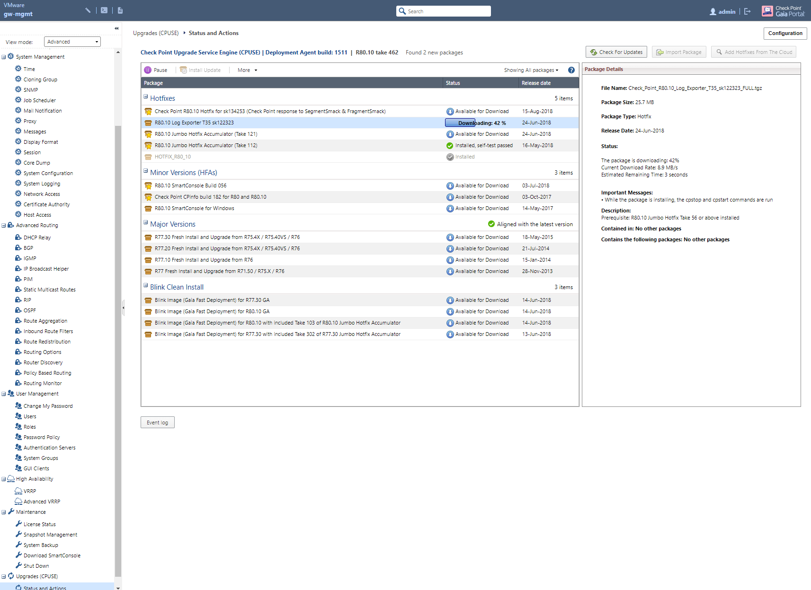
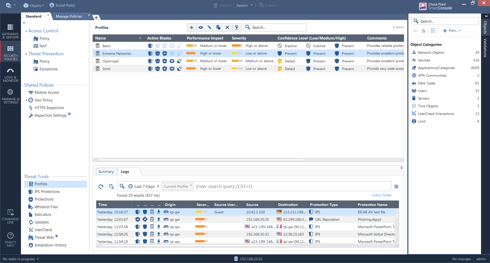
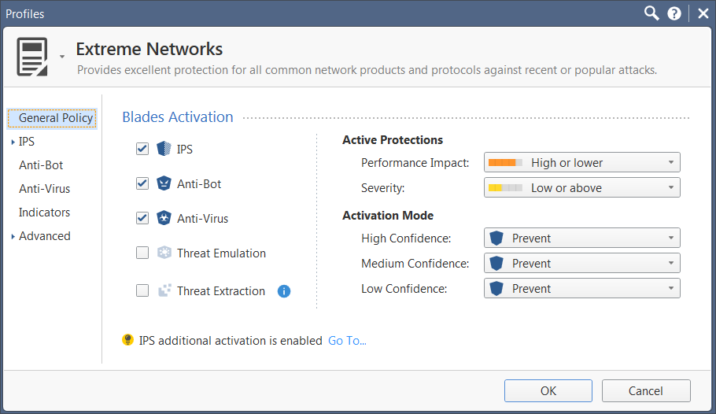
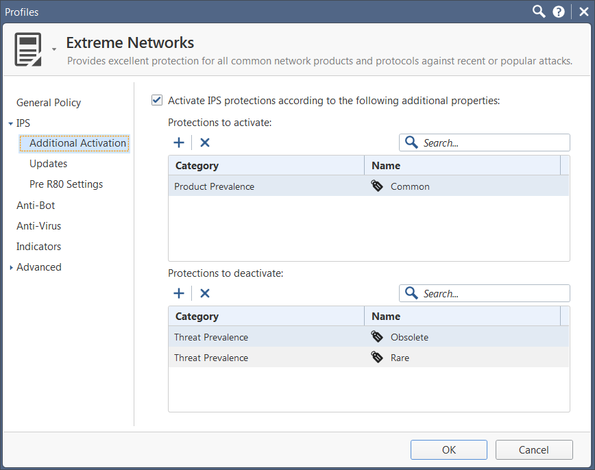
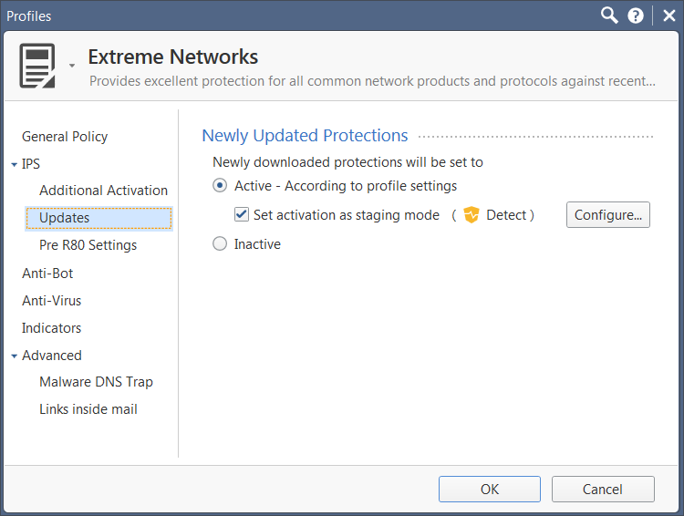
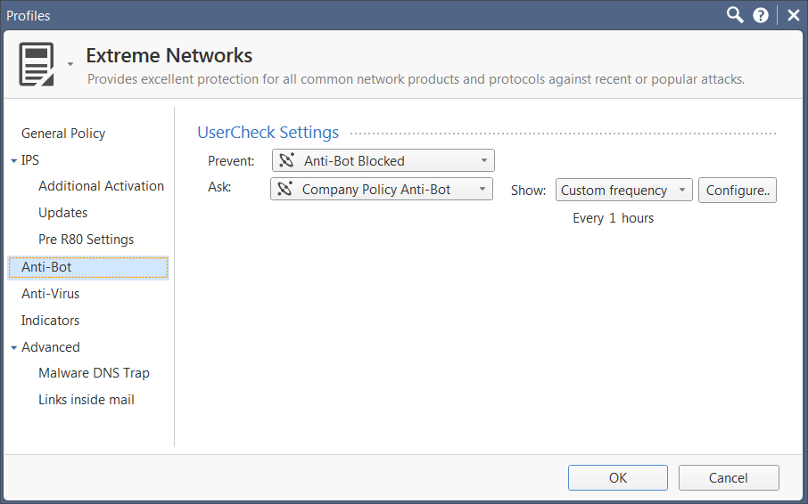
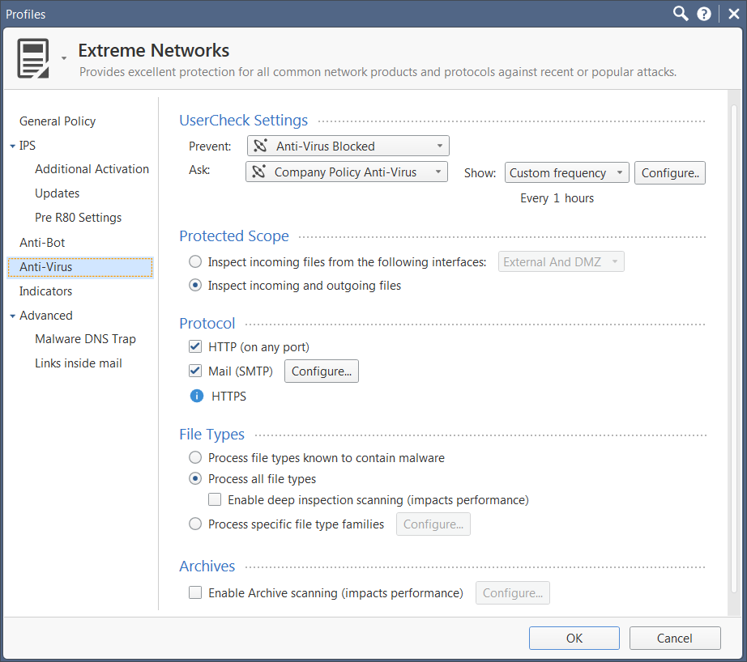
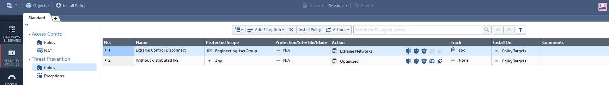
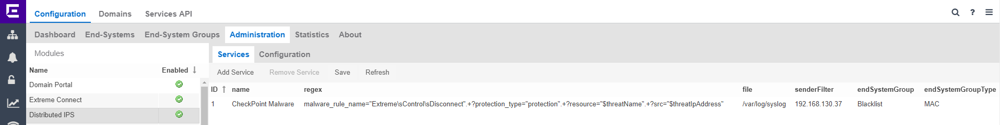
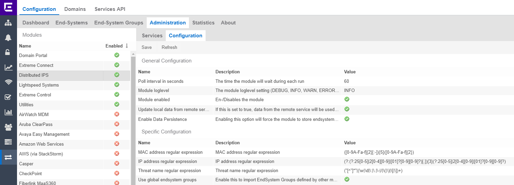

# Distributed IPS solutions

## Check Point configuration

### Log Exporter
* The Log Exporter can be installed on the management server of Check Point solution.
* The package Log exporter T35 sk122323 must be installed to enable syslog export. The Log Exporter should be integrated in the Check Point OS in next release.

* Connect to the Check Point management node through SSH or chose “Open Terminal” web menu. Enter the expert mode.
* Configure the Checkpoint CPlog.
```bash
#cp_log_export add name Extreme target-server “xmc ip address” target-port 514 protocol udp format generic
```
* Edit the log exporter configuration file.
```bash
#cd /opt/CPrt-R80/log_exporter/targets/Extreme(name of the export Name)/
#vi targetConfiguration.xml
```
  <is_enabled>true</is_enabled><!--Is the process allowed to run, and start on cpstart-->
  <!-- Destination section defines the properties of the export target -->
  <destination type="syslog"> <!-- Target output type -->
    <ip>X.X.X.X</ip><!--the ip of the syslog server-->
    <port>514</port><!--the port on which the syslog is listening to-->
```
* is_enabled needs to be true
* ip is your XMC server
* port shoul be 514
```
  <filter filter_out_by_connection="true">
                <field  name="product">
```
* filter_out_by_connection should be true
* Reboot is required to start the log exporter package

### IPS Inspection configuration 
* Clone an Threat profile (For example optimized to Extreme Networks).

* Example of Profile configuration.





* Create the Threat rule with your profile created previously. You can restrict DIPS reaction to one or more IP Subnet or to user group. You can use the name of the rule in Extreme Connect match conditions = Services. The Track must be set to Log to generate the syslog message.


## Extreme Connect configuration

* Check Point Log Exporter will inform the Extreme Connect by syslog messages.

* regex = `malware_rule_name="Extreme\sControl\sDisconnect".+?protection_type="protection".+?resource="$threatName".+?src="$threatIpAddress"`
* The regex does match only if the threat rule name is `Extreme Control Disconnect`.
* You may add more regex rules if the reaction should match other syslog messages.

* The module must be Module enabled  = True


# Support
_The software is provided as-is and [Extreme Networks](http://www.extremenetworks.com/) has no obligation to provide maintenance, support, updates, enhancements, or modifications. Any support provided by [Extreme Networks](http://www.extremenetworks.com/) is at its sole discretion._

Issues and/or bug fixes may be reported on [The Hub](https://community.extremenetworks.com/extreme).

>Be Extreme