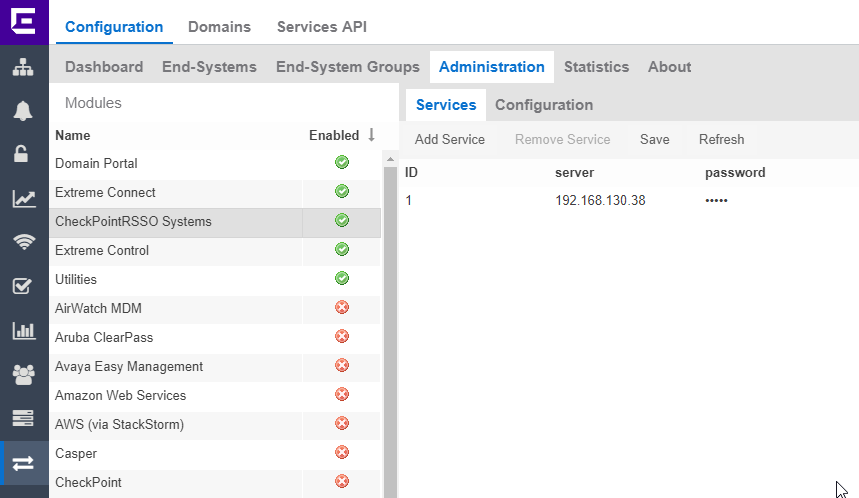
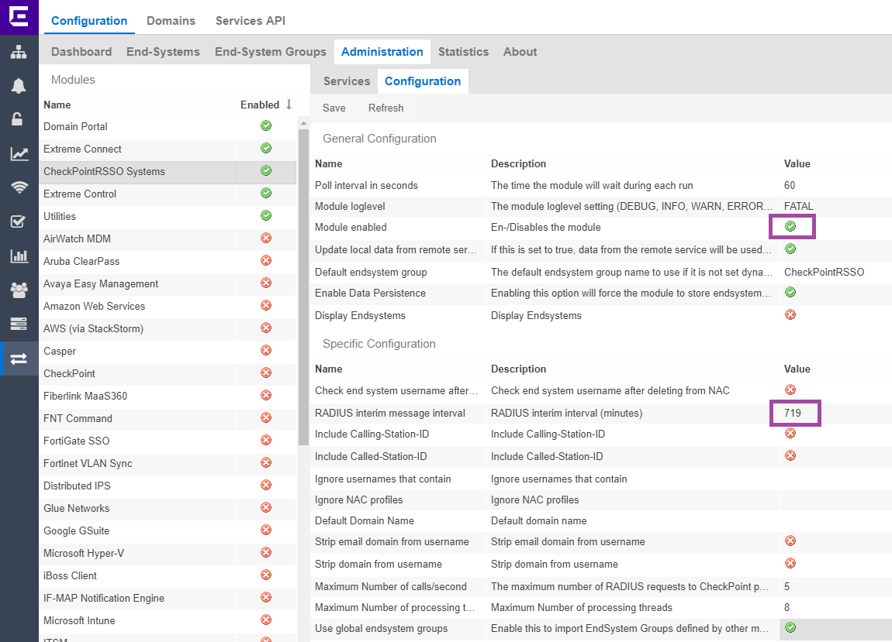
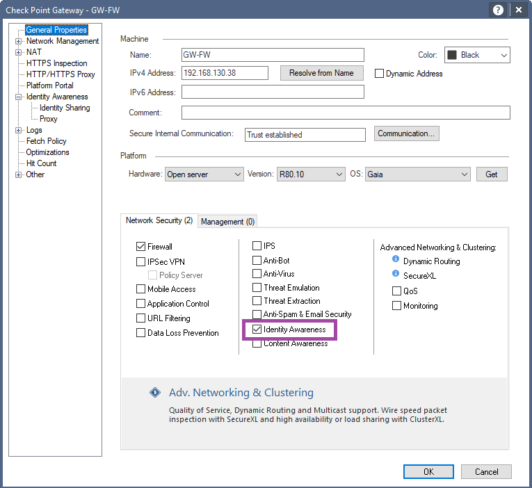
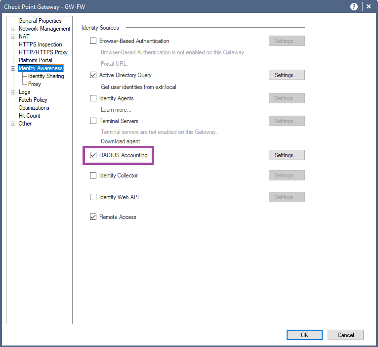
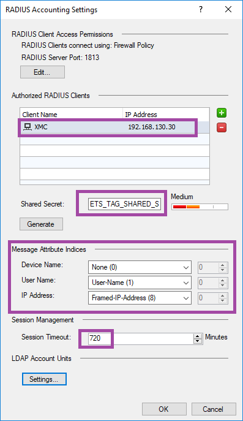
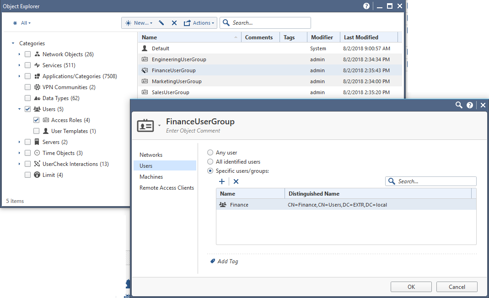
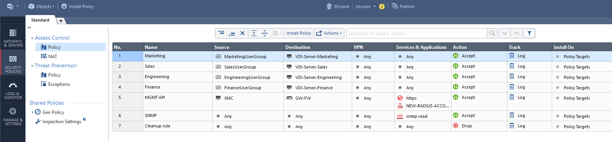

# Username to IP mapping

## Extreme Connect configuration
* To integrate with Check Point we can use LigthSpeed module available in Extreme Connect. The configution file: `/usr/local/Extreme_Networks/NetSight/wildfly/standalone/configuration/connect/LightSpeedHandler.xml` The content of the file can be adjusted = the module will de displayed as “CheckPointRSSO”:

* Server = IP address or FQDN of the Check Point firewall.
* Password = Shared Secret for radius communication from ExtremeCloud IQ - Site Engine to Check Point.

* Module enabled = True
* Radius interim message interval should be lower then timeout configured on Check Point

## Check Point configuration

### RSSO
* In the Check Point SmartConsole double click on your firewall blade and check the Identity Awareness.

* Identity Awareness menu check RADIUS Accounting and click on Settigngs...

* The Radius Accounging should be configured as follows...

* Authorized Radius Client is ExtremeCloud IQ - Site Engine.
* Shared Secret must match the one configured in the Extreme Connect module password.
* Session Timout should be longer then interrim update configured in Extreme Connect.
* Message Attribute Indices shoudl be configured properly.

### Active Directory
* In the Check Point SmartConsole double click on your firewall blade and check the Identity Awareness.

### Users / Group:
* Users or groups you want to use in your rules. You can open Object Explorer by CTRL+E.

### Rules:
* In the Check Point Smart Console use objects defined earlier in the Object Explorer.

# Support
_The software is provided as-is and [Extreme Networks](http://www.extremenetworks.com/) has no obligation to provide maintenance, support, updates, enhancements, or modifications. Any support provided by [Extreme Networks](http://www.extremenetworks.com/) is at its sole discretion._

Issues and/or bug fixes may be reported on [The Hub](https://community.extremenetworks.com/extreme).

>Be Extreme