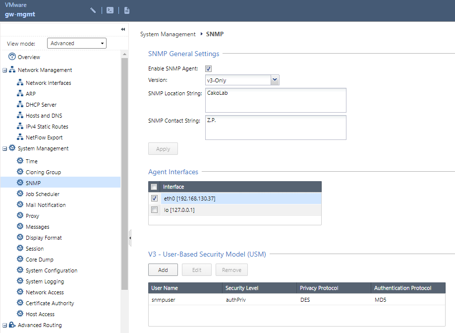

# Monitoring by Extreme Management Center

## Extreme Management Center configuration

### Access profile configuration
The communication between Extreme Management Center and Check Point appliance is based on SNMP.

### FlexViews
FlexViews for Check Point are published at this [repository](https://github.com/extremenetworks/Netsight-Report-Views/blob/master/FlexView/CheckPoint/README.md).
Download relevant flexviews and upload it to the following directory on the Extreme Management Center:
`install_path/Extreme_Networks/NetSight/appdata/System/FlexViews/My FlexViews`

### MIBs
Check Point FlexViews do need Check Point MIBs. To download mibs, you may visit the [Check Point Support Center](https://supportcenter.checkpoint.com/supportcenter/portal?eventSubmit_doGoviewsolutiondetails=&solutionid=sk90470).
Necessary MIBs should be imported to Extreme Management Center. [KB article](https://gtacknowledge.extremenetworks.com/articles/How_To/Netsight-Importing-a-MIB-into-Netsight)

### Vendor profile
Right click on the appliance at Network menu of Extreme Management Center -> Device -> Configure Device…: specify Device Type, Vendor, Company, Image and Family. If you want to use predefined DeviceView, then the Family must be `CheckPoint Security Gateway`. When the logo is first uploaded the preview may be with wrong aspect ratio:

### DeviceView
DeviceViews are published at this [repository](https://github.com/extremenetworks/Netsight-Report-Views/blob/master/DeviceView/CheckPoint/README.md)

## Check Point configuration

### SNMP
It is recommended to use SNMPv3, however v1 or v2c will work also. SNMP credentials must match those in the Access profile of the Extreme Management Center. Use your web browser, navigate to your Check Point node: System Management -> SNMP

# Support
_The software is provided as-is and [Extreme Networks](http://www.extremenetworks.com/) has no obligation to provide maintenance, support, updates, enhancements, or modifications. Any support provided by [Extreme Networks](http://www.extremenetworks.com/) is at its sole discretion._

Issues and/or bug fixes may be reported on [The Hub](https://community.extremenetworks.com/extreme).

>Be Extreme