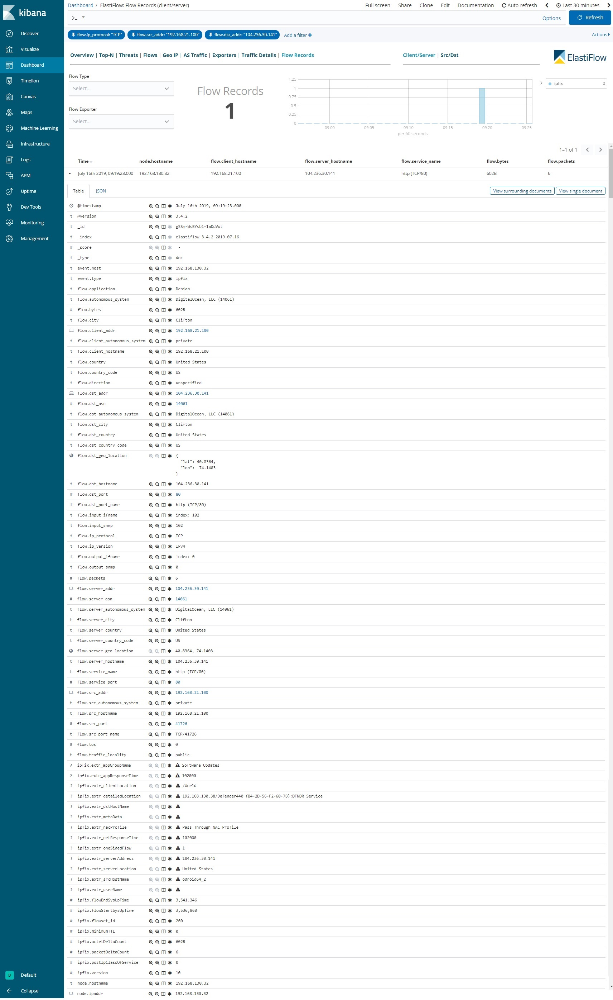
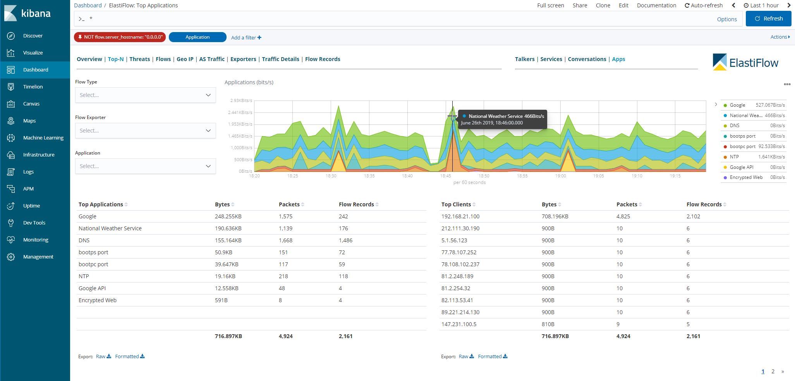
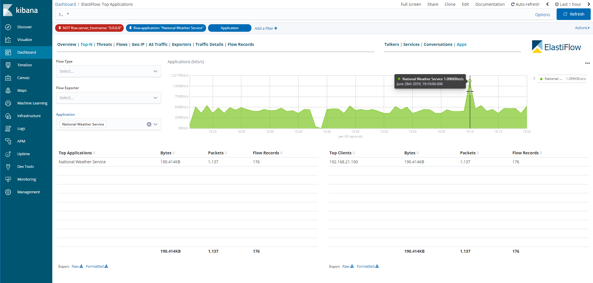
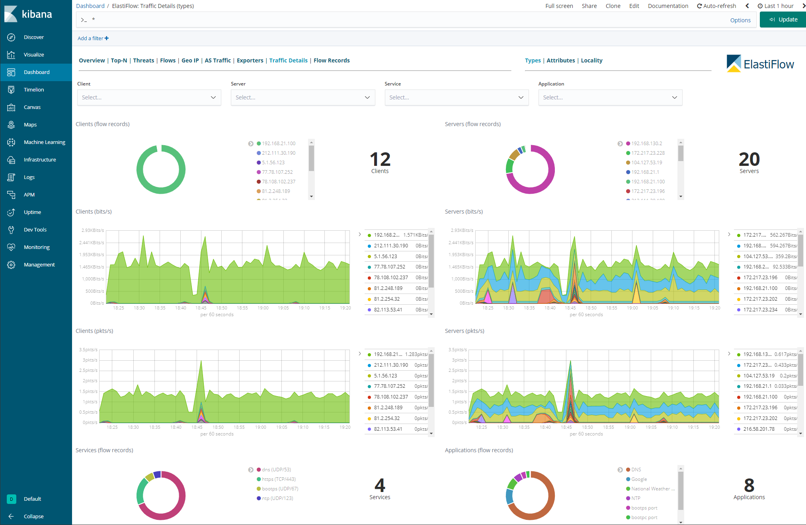
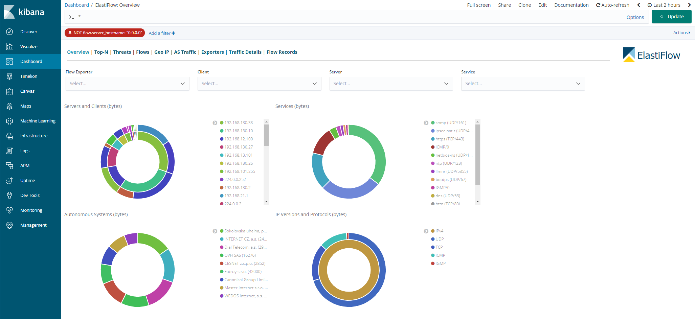
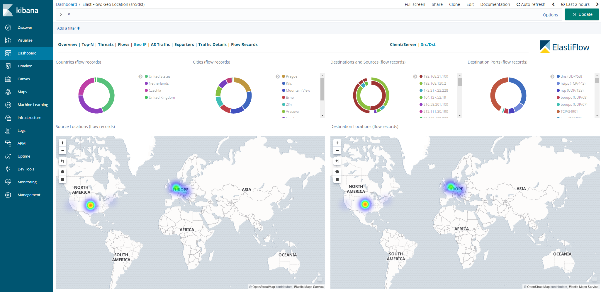

# ExtremeAnalytics & ELK

_Abstract: How to integrateExtremeAnalytics with Elasticsearch Logstash Kibana._

## Official documentation
[XMC Documentation](https://emc.extremenetworks.com/content/oneview/docs/analytics/docs/pur_elk.htm)

## Community documentation (additional details)
* Where to get `extr_elastiflow_3.4.2.tar.gz` mentioned in the official documentation?  
The file is part of the XMC 8.3 filesystem. Located at `install_path/Extreme_Networks/NetSight/appdata/Purview/ELK/extr_elastiflow_3.4.2.tar.gz`  
* Where to get `extr_udp_2055_logstash.tar.gz` mentioned in the official documentation?  
The file is part of the XMC 8.3 filesystem. Located at `install_path/Extreme_Networks/NetSight/appdata/Purview/ELK/extr_udp_2055_logstash.tar.gz`  

## Example of integration

# Support
_The software is provided as-is and [Extreme Networks](http://www.extremenetworks.com/) has no obligation to provide maintenance, support, updates, enhancements, or modifications. Any support provided by [Extreme Networks](http://www.extremenetworks.com/) is at its sole discretion._

Issues and/or bug fixes may be reported on [The Hub](https://community.extremenetworks.com/extreme).

>Be Extreme