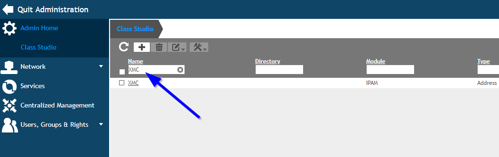

# Information enhancement

>Powered by S. Harrer [Bell Computer-Netzwerke GmbH](http://www.bell.de/) based on Zdenek Palas Infoblox integration.

## Extreme Management Center and EfficientIP (EIP) configuration

### Prepare EfficientIP extensible attributes when using EIP version 7.1 and newer
* Go to EfficientIP-GUI
* Go to "Admin Home"


* Select "Class Studio" in "Customization"


* Create a new custom class


* Configure and enable the new custom class


* Filter for the newly created class and click on the name to edit the class



* Add a TEXT AREA for the XMC Status


* Repead the previous step (= add a TEXT AREA) for the following information elements
	
	| Name     			| Label         	 | 
	|:-----------------	|:------------------ | 
	| xmcauthtype 		| XMC Authtype  	 | 
	| xmcswitchip 		| XMC SwitchIP    	 | 
	| xmcswitchport 	| XMC Switch Port    |  
	| xmcswitchlocation | XMC Switch Location|
	| xmcprofile		| XMC Profile 		 |
	| xmcusername 		| XMC Username		 |
	| xmcreason			| XMC Reason		 |
	| xmcupdate			| XMC Update		 |

* If you did the mentioned steps your class should look like the following picture


  
  
### Install the script
* Download the [XMC2EIP.py](XMC2EIP.py?raw=true)
* Update the variables in the XMC2EIP.py according your needs (Username,Password and IP Address)
```bash
varUser = "ipmadmin"
varPassword = "admin"
varEipIP = '1.1.1.1'
varDebug = True
varDebugFile = "XMC2EIP.log"
```
* Upload the `XMC2EIP.py` script to the Extreme Management Center to `/usr/local/bin`.
* Change the script to be executable:
```bash
chmod +x /usr/local/bin/XMC2EIP.py
```

### Setup notifications (execution of API calls) with XMC version 8.0 and newer
* Click "Add" in XMC Access Control Configuration -> Notifications


* Configure Notification


Program:	`/usr/local/bin/XMC2EIP.py`
Working Directory:	`/tmp`
Override Content:	`checked`
Edit Content `…`


Custom Arguments:
`Mac $macAddress Status $state Auth $authType SwitchIP $switchIP SwitchPort $switchPortId SwitchLocation $switchLocation Profile $nacProfileName User $username Reason $reason Time $lastSeenTime`

## Testing and usage
### Extensible attributes in IPAM
* Extensible attributes are stored in EfficientIP database only for Fixed Address / Reservation

* Extensible attributes can be used in EfficientIP filters


# Support
_The software is provided as-is and neither [Extreme Networks](http://www.extremenetworks.com/) nor [Bell Computer-Netzwerke](http://bell.de) has no obligation to provide maintenance, support, updates, enhancements, or modifications. Any support provided by [Extreme Networks](http://www.extremenetworks.com/) or [Bell Computer-Netzwerke](http://bell.de) is at its sole discretion._

Issues and/or bug fixes may be reported on [The Hub](https://community.extremenetworks.com/extreme).

>Be Extreme