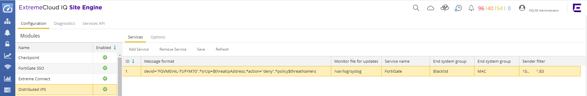
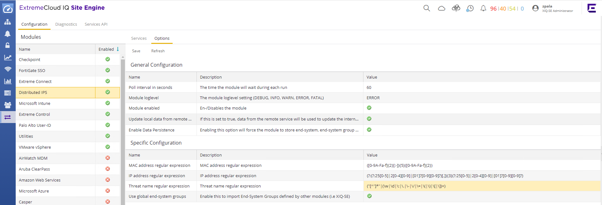
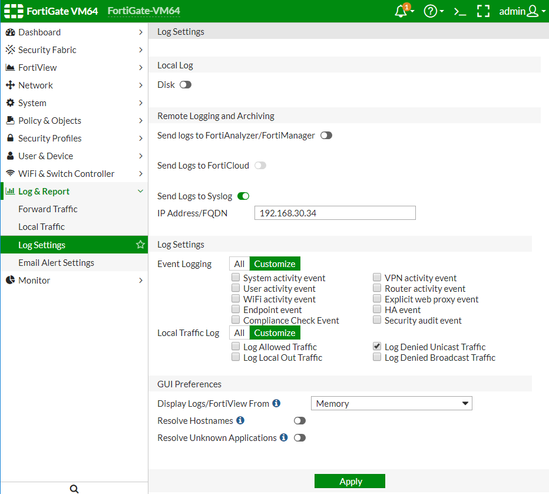
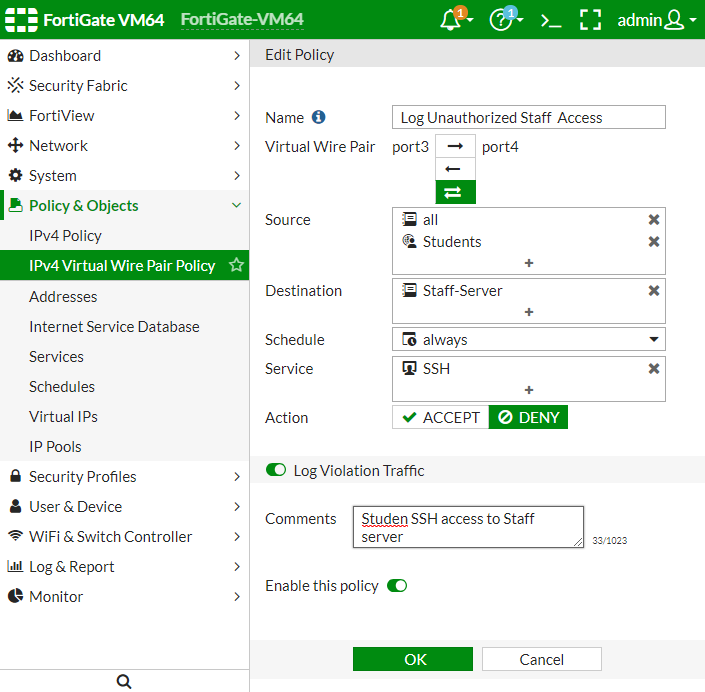

# Distributed IPS

## Extreme Management Center configuration
* FortiGate can inform the Extreme Connect to quarantine the end-system by syslog message. Open the OneView -> Connect -> Configuration -> Administration -> Distributed IPS -> Services  

* Regex for FortiGate v6: `devid="FGVMEV4L-TUFYM70".*srcip=$threatIpAddress.*action="deny".*policy$threatName\s`
Based on the FortiGate firewall settings the module can receive many syslog messages. It is very probable that customer will not want to Blacklist every device for each packet drop. Careful customization of the regex is recommended. The example above does match events from FortiGate with name `FGVMEV4L-TUFYM70`.  
* Regex for FortiGate v5: `devid=FGVMEV4L-TUFYM70.*srcip=$threatIpAddress.*action="deny".*policy$threatName\s`
Based on the FortiGate firewall settings the module can receive many syslog messages. It is very probable that customer will not want to Blacklist every device for each packet drop. Careful customization of the regex is recommended. The example above does match events from FortiGate with name `FGVMEV4L-TUFYM70`.  
* File:	`/var/log/syslog`
* senderFilter: name or IP of the sender
* endSystemGroup defines what group will be the endsystem assigned. Default is `Blacklist`, you can define your own.
* endSystemGroupType: `MAC`

  
* Module enabled `True`  
* Threat name regular expression: `("[^"]*"|(\w|\d|\:|\.|\-|\/|\=|\(|\)|\[|\])+)`
* Do not forget to save your changes.

## FortiGate
* In the FortiGate menu: Log & Report -> Log Settings -> IP Address/FQDN is the Extreme Management Center, Send Logs to Syslog enabled, configure what events you want to send to syslog.

* Enable logging in the rule you want the quarantine action to happen

# Support
_The software is provided as-is and [Extreme Networks](http://www.extremenetworks.com/) has no obligation to provide maintenance, support, updates, enhancements, or modifications. Any support provided by [Extreme Networks](http://www.extremenetworks.com/) is at its sole discretion._

Issues and/or bug fixes may be reported on [The Hub](https://community.extremenetworks.com/extreme).

>Be Extreme
