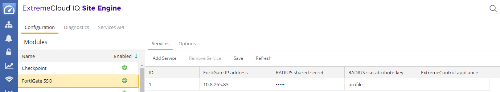
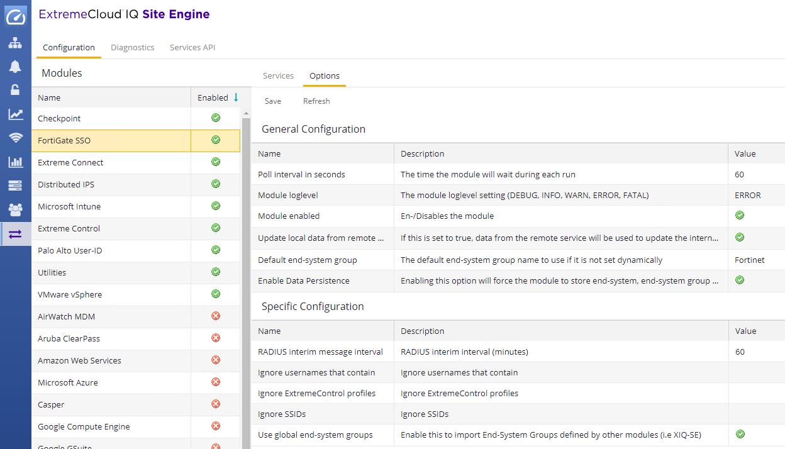
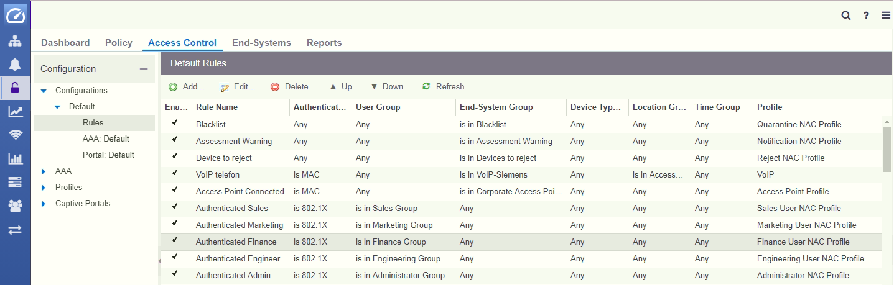

# User ID to IP mapping

## Why = Use Cases.
* Customer can apply different firewall rules based on location and does not have to separate locations by VLANs (Vlan separation will break WiFi roaming). = Different firewall rules on floor 2 comparing to floor 3.
* Customer can apply different firewall rules based on user group. = Different firewall rules for sales team comparing to engineering team.
* Customer can apply different firewall rules based on device type. = Different firewall rules for Mac and for Windows and for BYOD devices.

## How it works

   Endsystem connects to the access switch / access point. 
1. The radius communication reach the Access Control Engine. ACE does process configuration rules and based on conditions the Access Control Profile is chosen. Access Control Profile does assign Security Policy Profile. The Radius Access Accept is sent to the access switch / access point. There can be policy profile in the Radius Access Accept.
2. When the address resolution is finished (the XMC knows the IP address of the endsystem) the radius accounting message is sent to the firewall. The radius accounting message does contain IP address and username and Access Control Profile.
3. Firewall does apply its configuration on the traffic from the endsystem. Based on the infromation from the XMC the firewall knows the username for the source IP and also the Access Control Profile. The user group can be assigned based on the Access Control Profile.
4. Traffic is inspected by the firewall with rules reflecting the Access Control Profile.

## Extreme Connect configuration
* To integrate with FortiGate we can use FortiGate SSO module available in Extreme Connect.

* There can be more firewalls you want to integrate with = each does have unique ID.
* Server = IP address or FQDN of the FortiGate firewall = destination of radius accounting packages.
* Password = Shared Secret for radius communication from Extreme Management Center to FortiGate.
* ssoAttributeKey = what key will XMC send in the Radius Accounting message.

* addClassRadiusAttrbute = yes send the ssoAttributeKey in the radius accounting.
* primaryNAC = send Radius Accounting to this firewall if endsystem is processed by Access Control Engine (primary NAC-gw).
* backupNAC = send Radius Accounting to this firewall if endsystem is processed by Access Control Engine (backup NAC-gw).

* Module enabled = True.
* Radius interim message interval should be lower then timeout configured on FortiGate.
* Poll interval in seconds = how long will FortiGate SSO module wait between cycles.

## FortiGate configuration

### User & Device
* In the FortiGate menu User & Device -> Single Sign-on -> RSSO Agent -> Edit:

* Use Radius Shared Secret must match the one in Extreme Connect FortiGate SSO module:

* The RSSO must be configured from the CLI (SSH / telnet / webCLI). The important is rsso-attribute-key and rsso-endpoint-attribute:

* The XMC is sending Radius Accounting = in FortiGate it must be configured as Radius server. Yes I would call it Radius client but it is called server:

### System
* In the FortiGate menu System -> Feature Visibility -> Security Features “Endpoint Control” must be enabled:

### Network
* In the FortiGate menu Networks -> Interfaces -> The interface must be allowed to receive RADIUS-Accounting:

### User Groups
* In the FortiGate menu User & Device -> User Groups -> Mapping to the User Group is done based on Access Control Profile name. The RADIUS Attribute Value must match the Access Control Profile defined in Extreme Control.

## Extreme Control configuration
* Mapping to the FortiGate User Group is done based on Access Control Profile name:

## Testing and usage

### Extreme Control
* UserFinance is authenticated, IP address is resolved, Policy is applied on PEP, policy profile is assigned:

### FortiGate
* Rule using “Finance Group User” as condition and applies AntiVirus & Application Control & SSL inspection specific for the Finance Group:

* More complete picture of Firewall rules:

* Online monitor of the username & IP & group binding:

# Support
You can check the [Official Documentation](https://emc.extremenetworks.com/content/oneview/docs/connect/docs/l_ov_connect_security.htm#Fortinet).

_The documentation is provided as-is and [Extreme Networks](http://www.extremenetworks.com/) has no obligation to provide maintenance, support, updates, enhancements, or modifications. Any support provided by [Extreme Networks](http://www.extremenetworks.com/) is at its sole discretion._

Issues and/or bug fixes may be reported on [The Hub](https://community.extremenetworks.com/extreme).

>Be Extreme