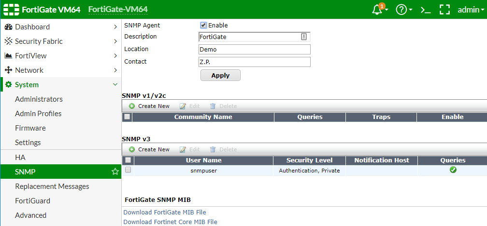

# Monitoring by ExtremeCloud IQ - Site Engine

## ExtremeCloud IQ - Site Engine configuration

### Access profile configuration
The communication between Site Engine and FortiGate appliance is based on SNMP.

### FlexViews
FlexViews for FortiGate are published at this [repository](https://github.com/extremenetworks/XMC-Report-Views/blob/master/FlexView/FortiGate/README.md).
Download relevant flexviews and upload it to the following directory on the Site Engine:
`install_path/Extreme_Networks/NetSight/appdata/System/FlexViews/My FlexViews`

### MIBs
FortiGate FlexViews do need FortiGate MIBs. You can download MIBs from the FortiGate System -> SNMP -> Download FortiGate MIB File & Download Fortinet Core MIB File.
Necessary MIBs should be imported to Site Engine. [KB article](https://extremeportal.force.com/ExtrArticleDetail?an=000080448&q=Netsight-Importing-a-MIB-into-Netsight)

### Vendor profile
Right click on the appliance at Network menu of Site Engine -> Device -> Configure Device…: specify Device Type, Vendor, Company, Image and Family. If you want to use predefined DeviceView, then the Family must be `FortiGate`. When the logo is first uploaded the preview may be with wrong aspect ratio:

### DeviceView
DeviceViews are published at this [repository](https://github.com/extremenetworks/XMC-Report-Views/blob/master/DeviceView/FortiGate/README.md)

## FortiGate configuration

### SNMP
It is recommended to use SNMPv3, however v1 or v2c will work also. SNMP credentials must match those in the Access profile of the Site Engine. Use your web browser, navigate to your FortiGate node: System Management -> SNMP

# Support
_The software is provided as-is and [Extreme Networks](http://www.extremenetworks.com/) has no obligation to provide maintenance, support, updates, enhancements, or modifications. Any support provided by [Extreme Networks](http://www.extremenetworks.com/) is at its sole discretion._

Issues and/or bug fixes may be reported on [The Hub](https://community.extremenetworks.com/extreme).

>Be Extreme