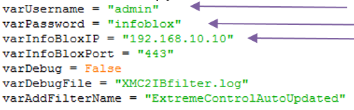
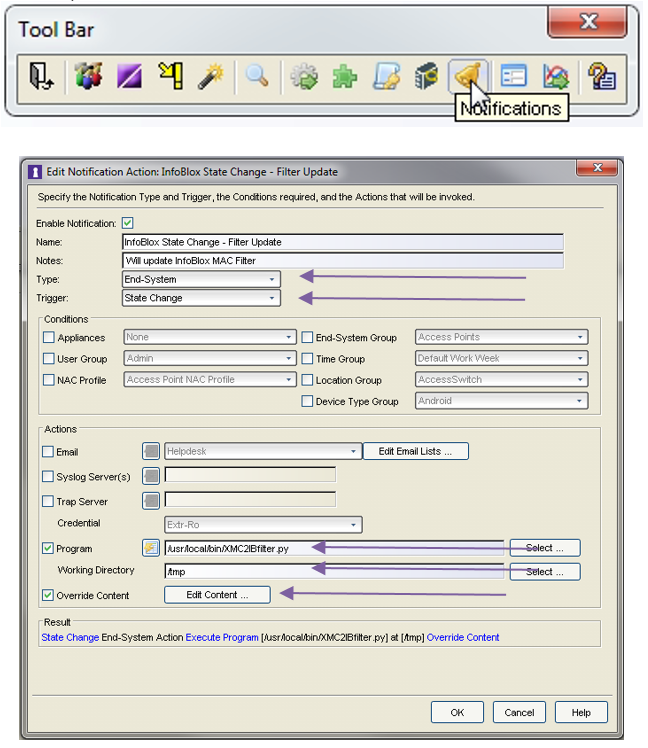
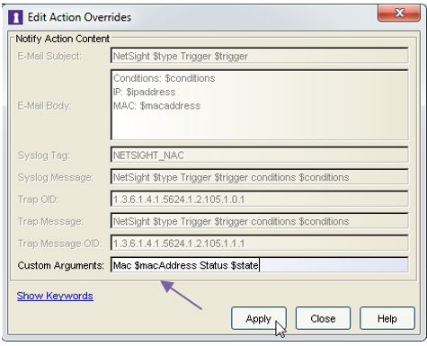
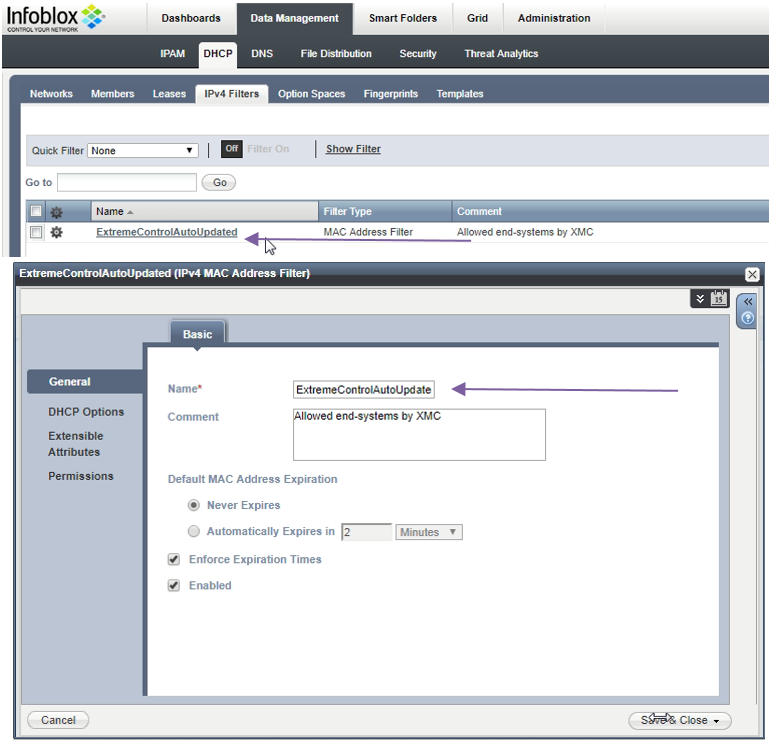
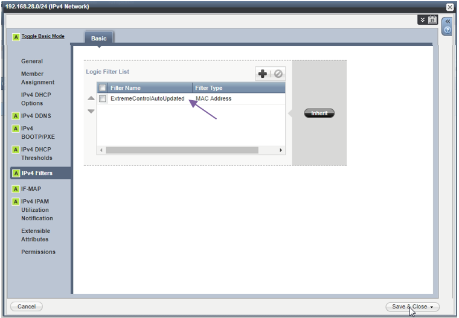
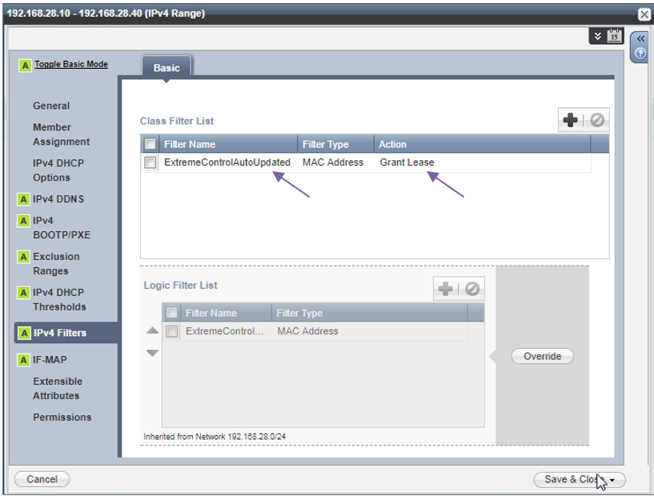
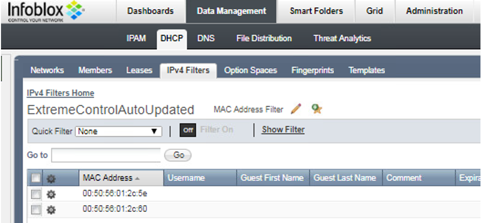

# DHCP pool protection

## Extreme Management Center configuration

### Install the script
* Download the [XMC2IBfilter.py](XMC2IBfilter.py)
* Update the variables in the `XMC2IBfilter.py`  
  
* Upload the `XMC2IBfilter.py` script to the Extreme Management Center to `/usr/local/bin`.
* Change the script to be executable:
```Bash
chmod +x /usr/local/bin/XMC2IBfilter.py
```

### Setup notifications = execution of API calls
* NAC Manager (Java application) -> Notifications  
  
Program: `/usr/local/bin/XMC2IBfilter.py`  
Working Directory: `/tmp`  
Override Content: `checked`  
Edit Content `…`  
  
Custom Arguments: `Mac $macAddress Status $state`  

## InfoBlox configuration  

### IPv4 filter
  
Name: `ExtremeControlAutoUpdated`

### IPv4 Network
* On each network subnet you want to controll what end-systems can get IP  
  

### IPv4 Range
* On each DHCP range you want to controll what end-systems can get IP  


## Testing and usage
* MAC is added to the IPv4 filter if the device is not in state Disconnected in Extreme Management  
  
* MAC is removed from the IPv4 filter if the device is in state Disconnected in Extreme Management

# Support
_The software is provided as-is and [Extreme Networks](http://www.extremenetworks.com/) has no obligation to provide maintenance, support, updates, enhancements, or modifications. Any support provided by [Extreme Networks](http://www.extremenetworks.com/) is at its sole discretion._

Issues and/or bug fixes may be reported on [The Hub](https://community.extremenetworks.com/extreme).

>Be Extreme