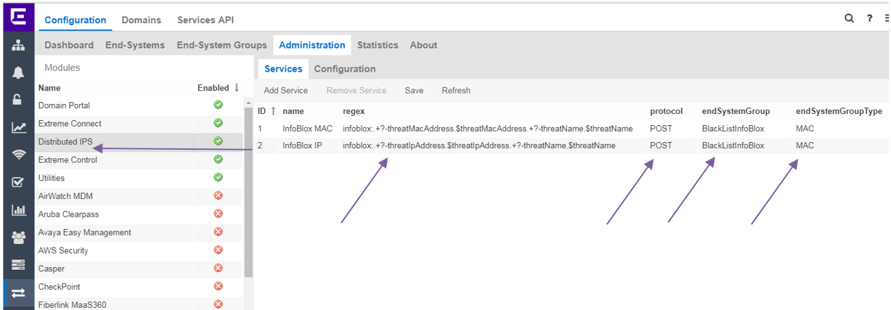
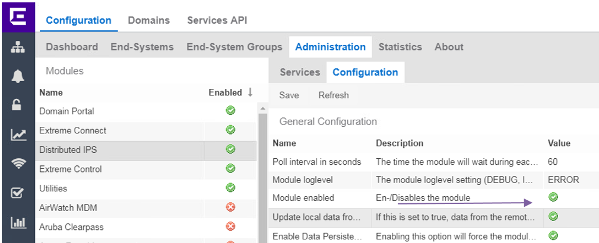
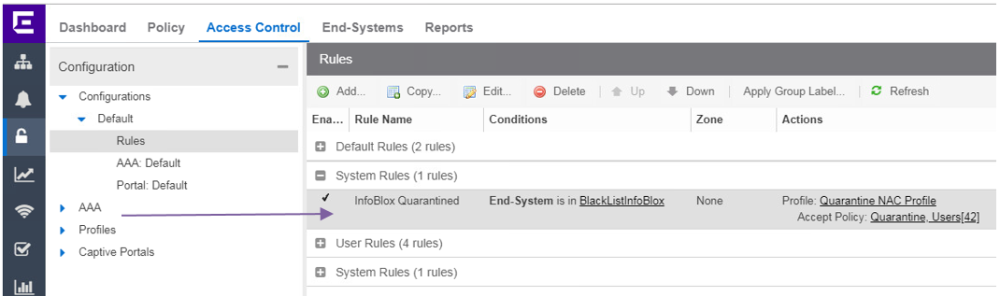
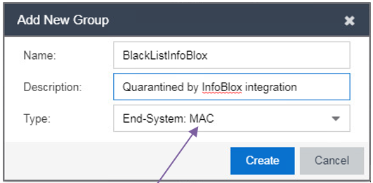
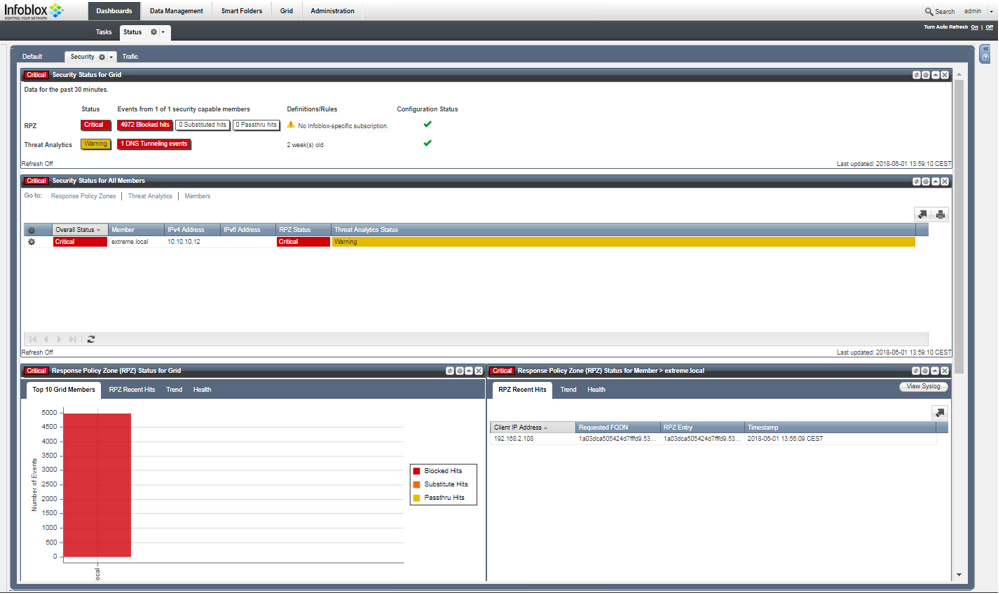
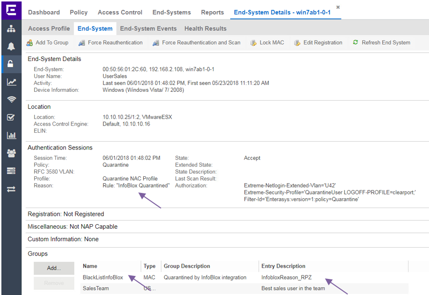

# Distributed IPS

## Extreme Management Center configuration

### Extreme Connect
* Infoblox can inform the Extreme Connect to quarantine the end-system by API calls. There are attack detected by InfoBlox where IP address is reported, there are other attacks where MAC address is reported.  
OneView -> Connect -> Configuration -> Administration -> Distributed IPS -> Services  
  
Regex 1: `infoblox:.+?-threatMacAddress.$threatMacAddress.+?-threatName.$threatName`  
Regex 2: `infoblox:.+?-threatIpAddress.$threatIpAddress.+?-threatName.$threatName`  
endSystemGroup defines what group will be the endsystem assigned. Default is Blacklist, you can define your own.  
  
Module enabled `True`  
Do not forget to save your changes.

### Extreme Control
* Create Access Control Rule which does match End-System group BlackListInfoBlox.  
  
* End-system group BlackListInfoBlox is type MAC.  
  
* Create user what will be used to call Connect API. The user must be able to login. No capabilities are needed for such user if Extreme Management is version 8.1.4+. Older versions require the user is part of NetSight Administrator.  

## Testing and usage

### Infoblox
The incident was detected and blocked  

### Extreme Management
Attacking end-system is assigned to the group “BlackListInfoBlox” with description based on Infoblox information. Reason is assigned based on Access Control Rule  

# Support
_The software is provided as-is and [Extreme Networks](http://www.extremenetworks.com/) has no obligation to provide maintenance, support, updates, enhancements, or modifications. Any support provided by [Extreme Networks](http://www.extremenetworks.com/) is at its sole discretion._

Issues and/or bug fixes may be reported on [The Hub](https://community.extremenetworks.com/extreme).

>Be Extreme