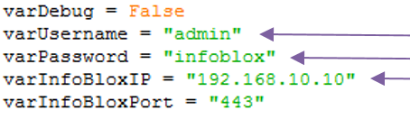
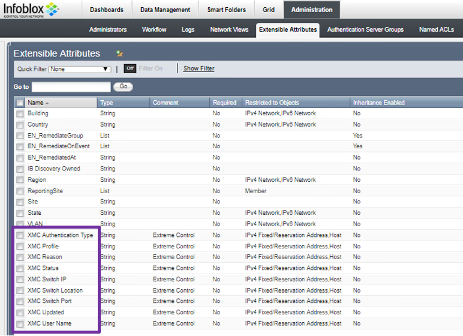
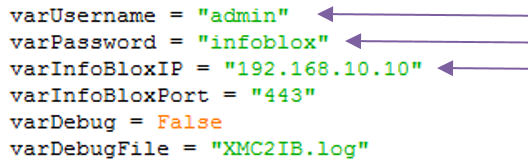
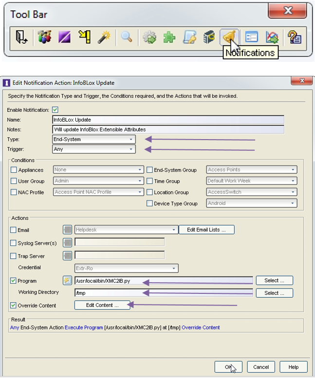
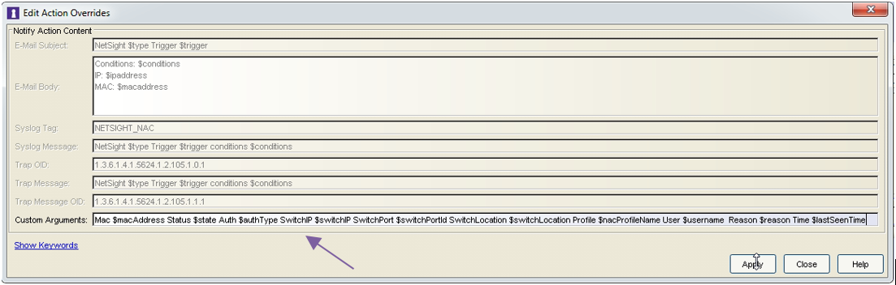
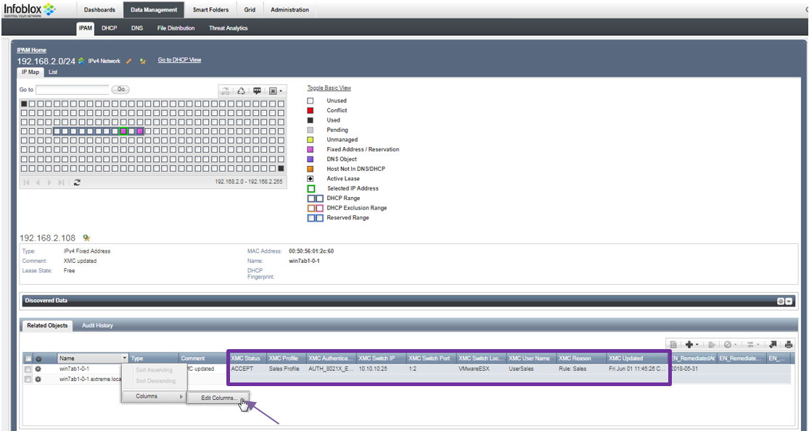
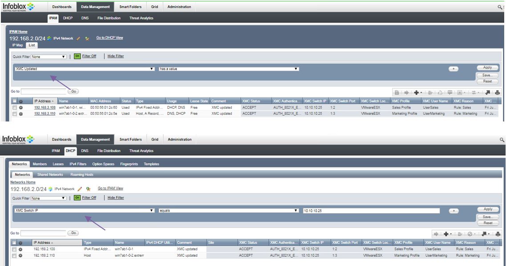

# Information enhancement

## Extreme Management Center configuration

### Prepare Infoblox extensible attributes in Infoblox
* Update the variables in the XMC2IB-first-once.py  

* Upload the 'XMC2IB-first-once.py' script to the Extreme Management Center.
* Change the script to be executable: 
```bash
chmod +x XMC2IB-first-once.py
```
* Execute the script 
```bash
./XMC2IB-first-once.py
```
* Verify Extensible attributes were created in Infoblox  

* You can delete the script if those Extensible attributes are present in Infoblox

### Install the script
* Update the variables in the XMC2IB.py  

* Upload the `XMC2IB.py` script to the Extreme Management Center to `/usr/local/bin`.
* Change the script to be executable: 
```bash
chmod +x /usr/local/bin/XMC2IB.py
```

### Setup notifications = execution of API calls
* NAC Manager (Java application) -> Notifications  

Program:	`/usr/local/bin/XMC2IB.py`
Working Directory:	`/tmp`
Override Content:	`checked`
Edit Content `…`  

Custom Arguments:
`Mac $macAddress Status $state Auth $authType SwitchIP $switchIP SwitchPort $switchPortId SwitchLocation $switchLocation Profile $nacProfileName User $username Reason $reason Time $lastSeenTime`

## Testing and usage
###Extensible attributes in the IPAM and DHCP
Extensible attributes are stored in Infoblox database only for Fixed Address / Reservation and for DNS objects:  

Extensible attributes can be used in Infoblox filters for both IPAM and DHCP:  



# Support
_The software is provided as-is and [Extreme Networks](http://www.extremenetworks.com/) has no obligation to provide maintenance, support, updates, enhancements, or modifications. Any support provided by [Extreme Networks](http://www.extremenetworks.com/) is at its sole discretion._

Issues and/or bug fixes may be reported on [The Hub](https://community.extremenetworks.com/extreme).

>Be Extreme