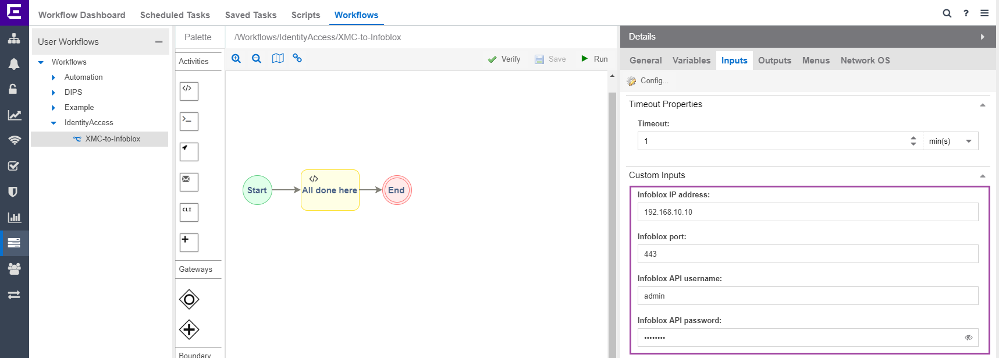
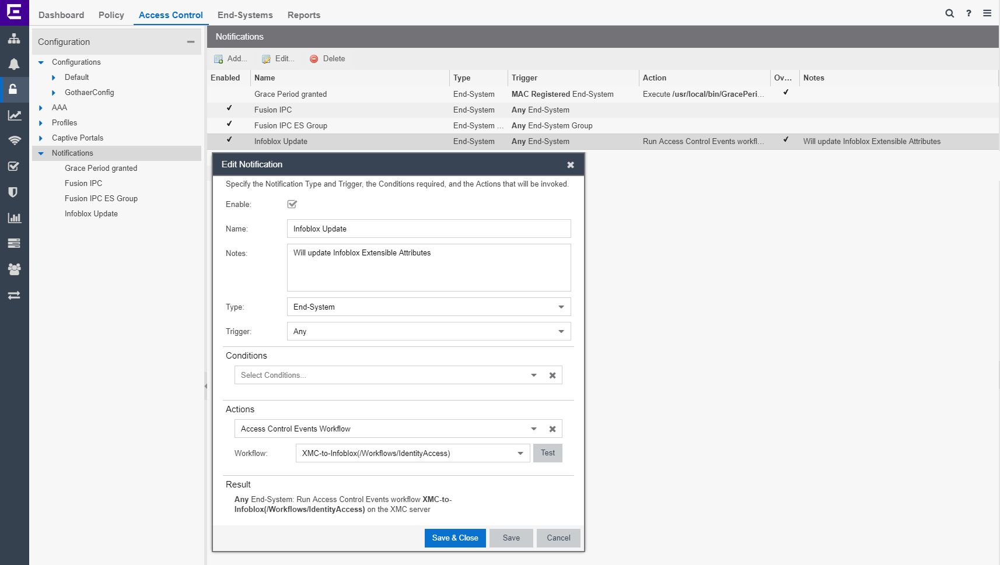

# Information enhancement

## Extreme Management Center 8.2+ configuration

### Prepare Infoblox extensible attributes in Infoblox when using XMC version 8.2+
* Download the XMC script [XMC2IB-first-once](XMC2IB-first-once.xml)
* Import the script to the XMC
* Run the script
* Chose Infoblox device from the XMC database
* Enter API credentials

* Verify Extensible attributes were created in Infoblox

* Now you do not need this script anymore 


### Install the Workflow
* Download the [XMC-to-Infoblox](XMC-to-Infoblox-21.4.11.2v19.xwf)
* Import Workflow to the XMC
* Update the variables in the workflow



### Setup notifications = execution of API calls
* OneView -> Control -> Access Control -> Configuration -> Notifications -> Add...



## Extreme Management Center 8.0 and 8.1 configuration

### Prepare Infoblox extensible attributes in Infoblox when using XMC version 8.0 or 8.1
* Download the [XMC2IB-first-once.py](XMC2IB-first-once.py)
* Update the variables in the XMC2IB-first-once.py

* Upload the `XMC2IB-first-once.py` script to the Extreme Management Center.
* Change the script to be executable:
```bash
chmod +x XMC2IB-first-once.py
```
* Execute the script
```bash
./XMC2IB-first-once.py
```
* Verify Extensible attributes were created in Infoblox

* You can delete the script now if those Extensible attributes are present in Infoblox
```bash
rm XMC2IB-first-once.py
```

### Install the script
* Download the [XMC2IB.py](XMC2IB.py)
* Update the variables in the XMC2IB.py

* Upload the `XMC2IB.py` script to the Extreme Management Center to `/usr/local/bin`.
* Change the script to be executable:
```bash
chmod +x /usr/local/bin/XMC2IB.py
```

### Setup notifications = execution of API calls
* NAC Manager (Java application) -> Notifications

Program:	`/usr/local/bin/XMC2IB.py`
Working Directory:	`/tmp`
Override Content:	`checked`
Edit Content `…`

Custom Arguments:
`Mac $macAddress Status $state Auth $authType SwitchIP $switchIP SwitchPort $switchPortId SwitchLocation $switchLocation Profile $nacProfileName User $username Reason $reason Time $lastSeenTime`

## Testing and usage
### Extensible attributes in the IPAM and DHCP
* Extensible attributes are stored in Infoblox database only for Fixed Address / Reservation and for DNS objects

* Extensible attributes can be used in Infoblox filters for both IPAM and DHCP


# Support
_The software is provided as-is and [Extreme Networks](http://www.extremenetworks.com/) has no obligation to provide maintenance, support, updates, enhancements, or modifications. Any support provided by [Extreme Networks](http://www.extremenetworks.com/) is at its sole discretion._

Issues and/or bug fixes may be reported on [The Hub](https://community.extremenetworks.com/extreme).

>Be Extreme