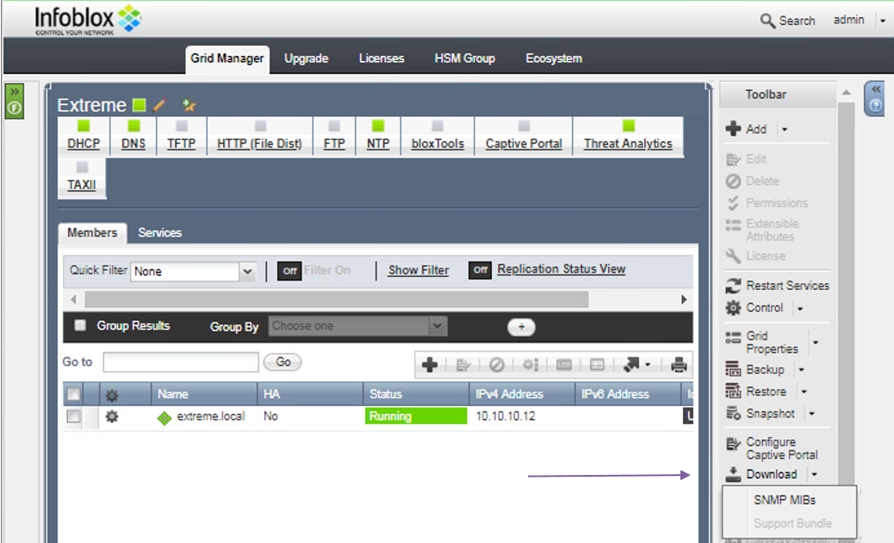
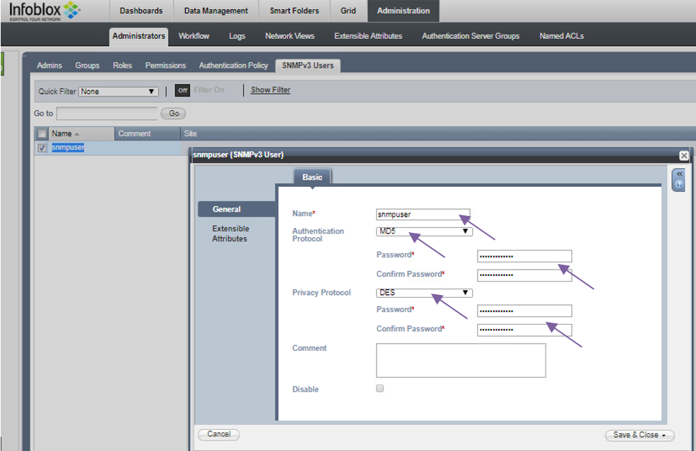
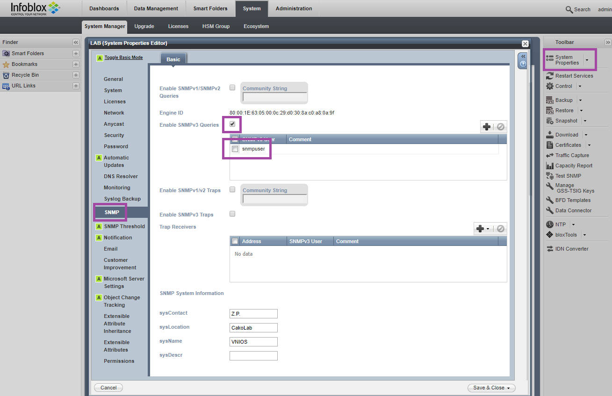

# Monitoring by Extreme Management Center

## Extreme Management Center configuration

### Access profile configuration
The communication between Extreme Management Center and Infoblox is based on SNMP and API calls (https). API calls are originated from Extreme Management Center to enhance the Infoblox information (Extensible attributes, IP filters). API calls are originated from Infoblox to quarantine the attacker.

### FlexViews
Flexviews for Infoblox are published at this [repository](https://github.com/extremenetworks/Netsight-Report-Views/blob/master/FlexView/InfoBlox/README.md)
Download relevant flexviews and upload it to the following directory on the Extreme Management Center:
`install_path/Extreme_Networks/NetSight/appdata/System/FlexViews/My FlexViews`

### MIBs
MIBs are part of the Infoblox product. Just download it from the GUI and unpack the file.

Necessary Mibs should be imported to Extreme Management Center. [KB article](https://extremeportal.force.com/ExtrArticleDetail?an=000080448&q=Netsight-Importing-a-MIB-into-Netsight)

### Vendor profile
Right click on the device at Network menu of Extreme Management Center -> Device -> Configure Device…: specify Device Type, Vendor, Company, Image and Family. If you want to use predefined Device View, then the Family must be `Infoblox DDI`. When the logo is first uploaded the preview may be with wrong aspect ratio:

### DeviceView
DeviceViews are published at this [repository](https://github.com/extremenetworks/Netsight-Report-Views/blob/master/DeviceView/InfoBlox/README.md)

## Infoblox configuration

### SNMPv3
SNMP credentials must match those in the Access profile of the Extreme Management Center

SNMP queries must be enabled

# Support
_The software is provided as-is and [Extreme Networks](http://www.extremenetworks.com/) has no obligation to provide maintenance, support, updates, enhancements, or modifications. Any support provided by [Extreme Networks](http://www.extremenetworks.com/) is at its sole discretion._

Issues and/or bug fixes may be reported on [The Hub](https://community.extremenetworks.com/extreme).

>Be Extreme