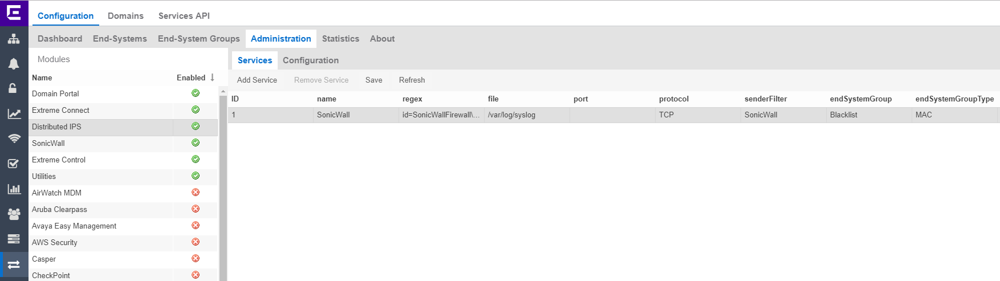

# Distributed IPS

## Extreme Management Center configuration

### Extreme Connect
* SonicWall can inform the Extreme Connect to quarantine the end-system by API calls.
OneView -> Connect -> Configuration -> Administration -> Distributed IPS -> Services  

* Regex: `id=SonicWallFirewall\s.+msg="IPS\sPrevention\sAlert:\s$threatName".+?ipspri=3.+?src=$threatIpAddress`
Based on the IPS settings on the SonicWall firewall the module can receive many syslog messages. It is very probable that customer will not want to Blacklist every device. Careful customization of the regex is recommended. The example above does match only IPS Prevention events with priority 3.  
* File:	`/var/log/syslog`
* senderFilter: name or IP of the sender
* endSystemGroup defines what group will be the endsystem assigned. Default is Blacklist, you can define your own.
* endSystemGroupType:	MAC

  
* Module enabled `True`  
* Threat name regular expression: `("[^"]*"|(\s|\w|\d|\:|\.|\-|/|\(|\)|\[|\])+)`
* Do not forget to save your changes.

### SonicWall

#### Destination of your logs
In the SonicWall menu: MANAGE -> Objects -> Address Objects -> + Add
[Object](Object.png)
In the SonicWall menu: MANAGE -> Log Settings -> SYSLOG -> ADD
[Syslog](Syslog.png)
Event profile is ID of the syslog destination (XMC)
#### Map log category to your syslog server
In the SonicWall menu: MANAGE -> Log Settings -> Base Setup -> Log -> IPS -> IPS Prevention Alert
[IPS Alert](Alert.png)
Use the same ID as defined for the syslog destination (XMC)
#### Enable IPS per Zone
In the SonicWall menu: MANAGE -> Network -> Zones -> Users -> Enable IPS
[IPS Zone](IPSzone.png)
#### Configure IPS
In the SonicWall menu: MANAGE -> Security Services -> Intrusion Prevention -> Enable IPS & choose what you want to prevent
[IPS Config](IPS.png)

# Support
_The software is provided as-is and [Extreme Networks](http://www.extremenetworks.com/) has no obligation to provide maintenance, support, updates, enhancements, or modifications. Any support provided by [Extreme Networks](http://www.extremenetworks.com/) is at its sole discretion._

Issues and/or bug fixes may be reported on [The Hub](https://community.extremenetworks.com/extreme).

>Be Extreme