# Information enhancement

## Extreme Management Center configuration

### Extreme Connect configuration
To integrate with SonicWall we can use LigthSpeed module available in Extreme Connect. The configution file: `/usr/local/Extreme_Networks/NetSight/wildfly/standalone/configuration/connect/LightSpeedHandler.xml` The content of the file can be adjusted = the module will de displayed as “SonicWall”:
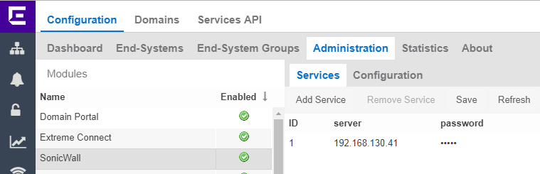
* Server = IP address or FQDN of the SonicWall firewall.
* Password = Shared Secret for radius communication from Extreme Management Center to SonicWall.
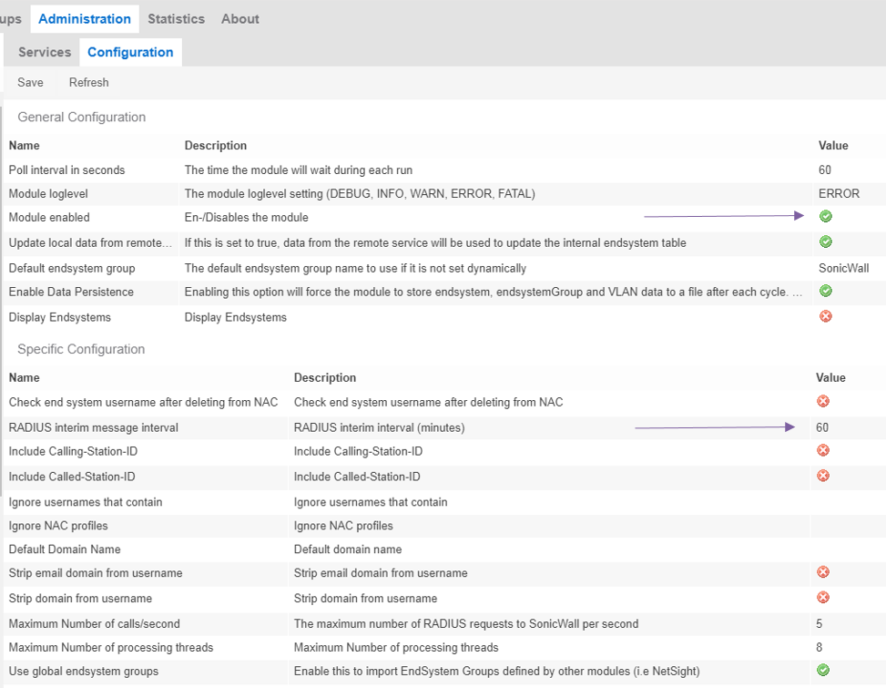
* Module enabled = True
* Radius interim message interval should be lower then timeout configured on SonicWall

### SonicWall configuration

#### RSSO
In the SonicWall menu: MANAGE -> Users -> Settings -> Authentication
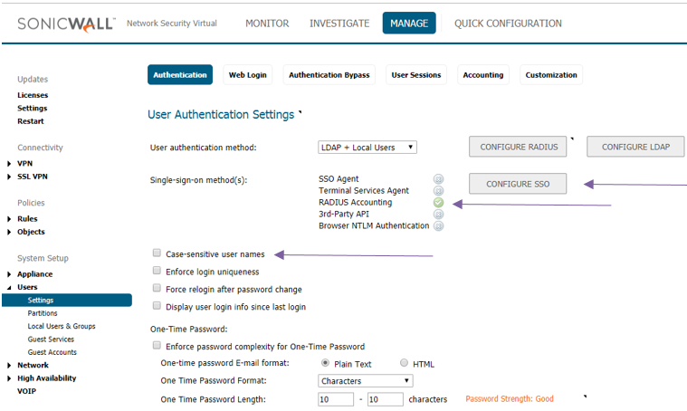
* Case-sensitive user names must be unchecked (radius accounting is sending all lowercase)
* RADIUS Accounting needs to be enabled
In the SonicWall menu: MANAGE -> Users -> Settings -> Authentication -> CONFIGURE SSO -> RADIUS Accounting -> Accounting Clients -> ADD… 
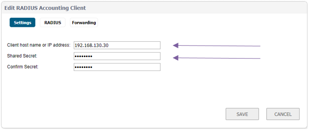
* Client host name or IP address = address of Extreme Management Center
* Shared Secret must match the one configured in Extreme Connect.
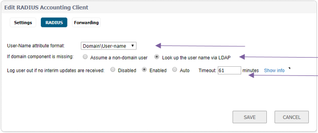
* User-Name attribute format = should match the format the user does use.
* Timout should be longer then interrim update configured in Extreme Connect.

* Status will be green after first radius accounting frame.

#### LDAP
In the SonicWall menu: MANAGE -> Users -> Settings -> Authentication -> Configure LDAP
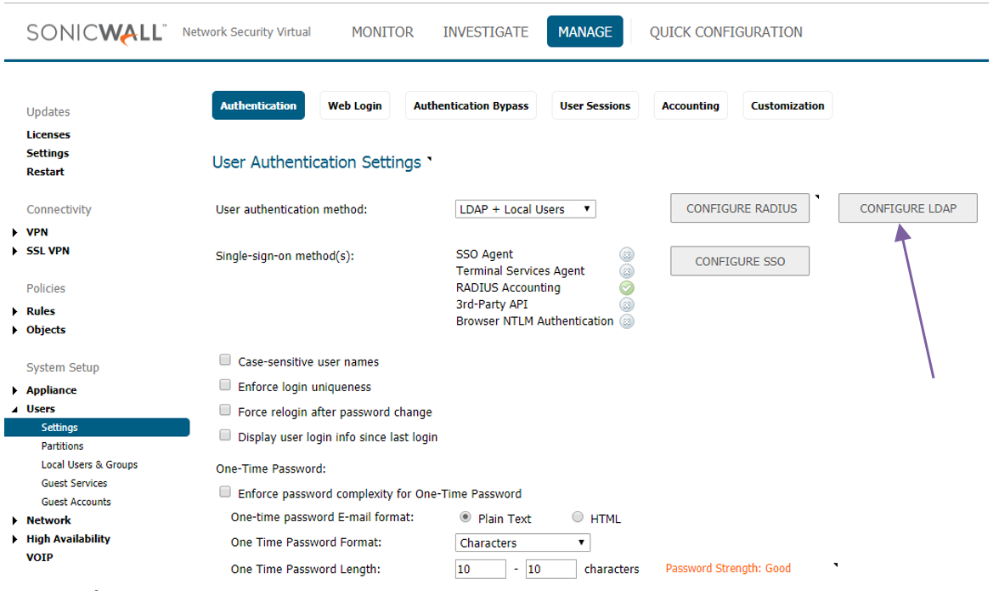
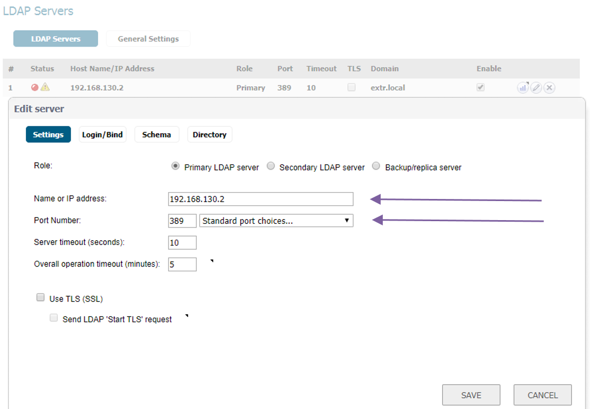
* Name or IP address = your LDAP/AD server
* Port = 389 for LDAP, 636 for LDAPs
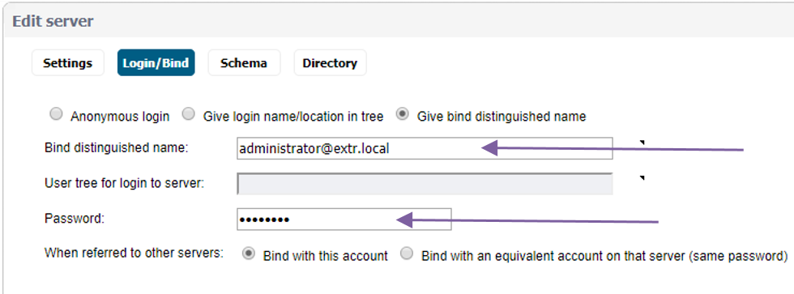
* Bind distinguished name = username with LDAP rights to login/bind.
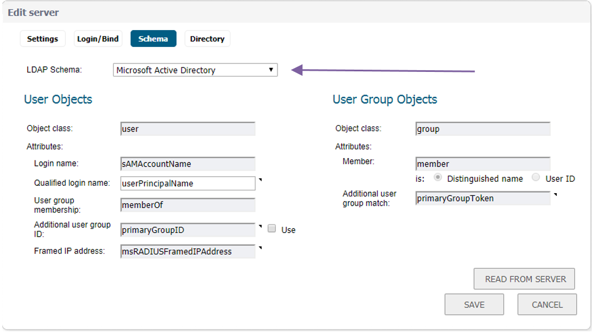
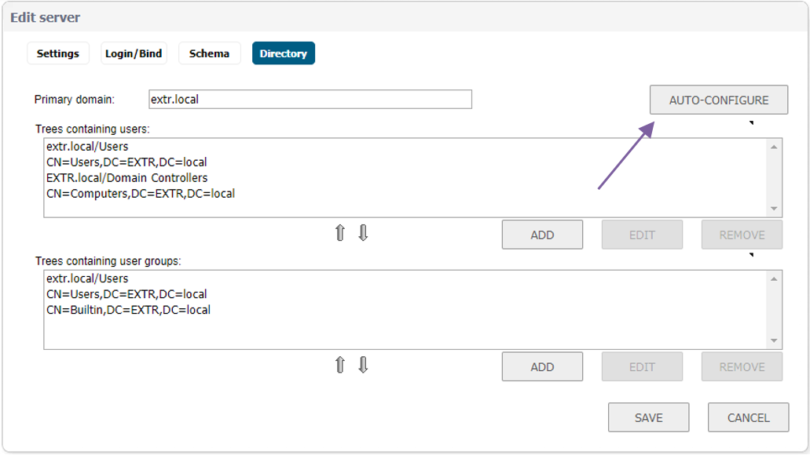

#### Users / Group:
Users or groups you want to use in your rules you need to import from LDAP.
In the SonicWall menu: MANAGE -> Users -> Local users & Groups -> Local Groups -> Import from LDAP:
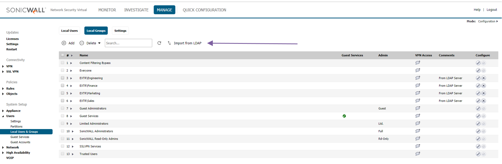

#### Rules:
In the SonicWall menu: MANAGE -> Rules -> Access Rules
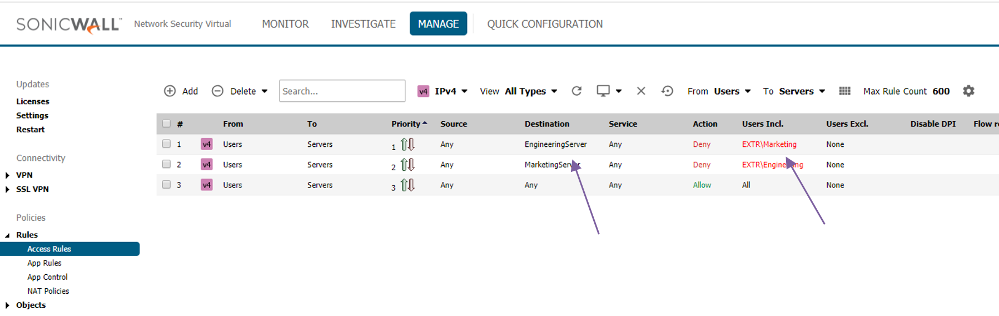
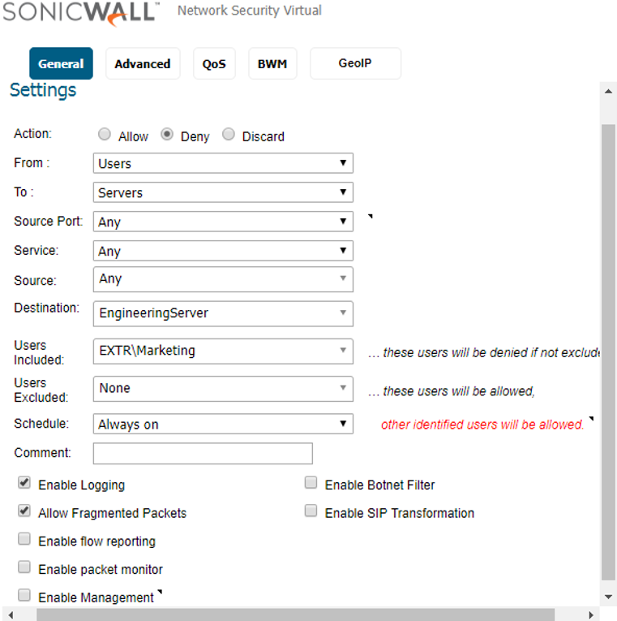

# Support
_The software is provided as-is and [Extreme Networks](http://www.extremenetworks.com/) has no obligation to provide maintenance, support, updates, enhancements, or modifications. Any support provided by [Extreme Networks](http://www.extremenetworks.com/) is at its sole discretion._

Issues and/or bug fixes may be reported on [The Hub](https://community.extremenetworks.com/extreme).

>Be Extreme