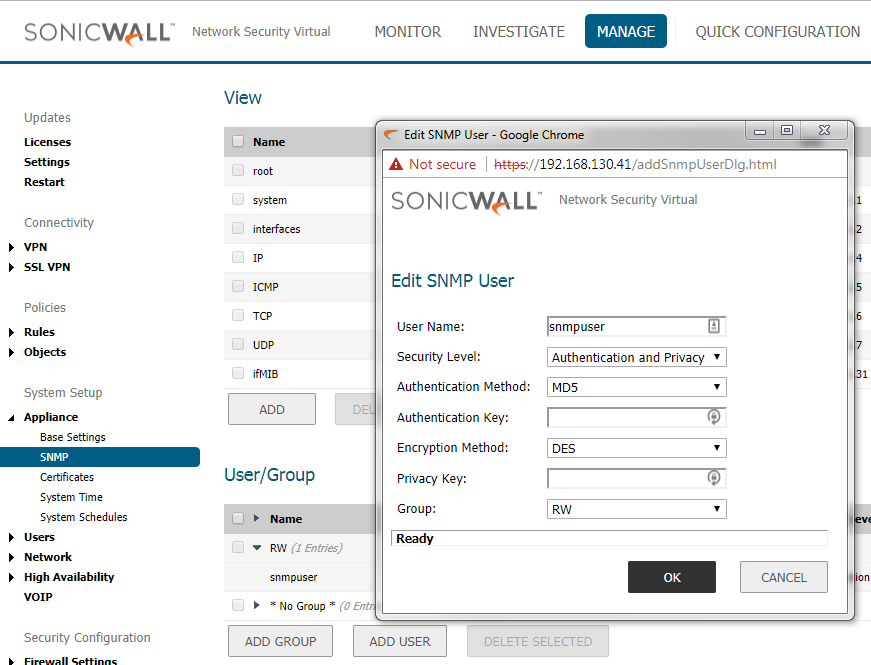

# Monitoring by Extreme Management Center

## Extreme Management Center configuration

### Access profile configuration
The communication between Extreme Management Center and SonicWall is based on SNMP.

### FlexViews
Flexviews for SonicWall are published at this [repository](https://github.com/extremenetworks/Netsight-Report-Views/blob/master/FlexView/SonicWall/README.md)
Download relevant flexviews and upload it to the following directory on the Extreme Management Center:
`install_path/Extreme_Networks/NetSight/appdata/System/FlexViews/My FlexViews`

### MIBs
SonicWall flexviews do need SonicWall MIBs. To download mibs, you will need access to mysonicwall.com. Each SonicWall customer with a valid license does have access there.
[KB article](https://www.sonicwall.com/en-us/support/knowledge-base/170503581936826).
Necessary MIBs should be imported to Extreme Management Center. [KB article](https://extremeportal.force.com/ExtrArticleDetail?an=000080448&q=Netsight-Importing-a-MIB-into-Netsight)

### Vendor profile
Right click on the Firewall at Network menu of Extreme Management Center -> Device -> Configure Device…: specify Device Type, Vendor, Company, Image and Family. If you want to use predefined Device View, then the Family must be `Network Security`. When the logo is first uploaded the preview may be with wrong aspect ratio:

### DeviceView
DeviceViews are published at this [repository](https://github.com/extremenetworks/Netsight-Report-Views/blob/master/DeviceView/SonicWall/README.md)

## SonicWall configuration

### SNMPv3
SNMP credentials must match those in the Access profile of the Extreme Management Center. In the SonicWall menu: MANAGE -> Appliance -> SNMP -> User/Group -> ADD USER

# Support
_The software is provided as-is and [Extreme Networks](http://www.extremenetworks.com/) has no obligation to provide maintenance, support, updates, enhancements, or modifications. Any support provided by [Extreme Networks](http://www.extremenetworks.com/) is at its sole discretion._

Issues and/or bug fixes may be reported on [The Hub](https://community.extremenetworks.com/extreme).

>Be Extreme