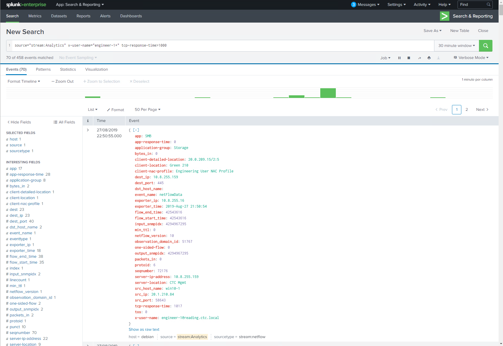

# ExtremeAnalytics & Splunk

_Abstract: How to integrate ExtremeAnalytics with Splunk._

## Official documentation
[XMC Documentation](https://emc.extremenetworks.com/content/oneview/docs/analytics/docs/pur_splunk.htm)

## Community documentation (additional details)
* What if there is no splunk_app_stream directory in my Splunk install?  
You need to install Splunk Stream app. Go to [splunkbase](http://splunkbase.com/app/1809/).
* Where to get Extreme's version of `streamfwd.conf` mentioned in the official documentation?  
The file is part of the XMC 8.3 filesystem. Located at `install_path/Extreme_Networks/NetSight/appdata/Purview/Splunk/streamfwd.conf`  
* I do not have `$SPLUNK_HOME/etc/apps/splunk_app_stream/default/vocabulary` in my Splunk 7.3  
Use `$SPLUNK_HOME/etc/apps/splunk_app_stream/default/vocabularies`.  
* I do not have `$SPLUNK_HOME/etc/apps/splunk_app_stream/default/vocabulary/streams` in my Splunk 7.3  
Use `$SPLUNK_HOME/etc/apps/splunk_app_stream/default/streams`.  
* Where to get `extr.xml` mentioned in the official documentation?  
The file is part of the XMC 8.3 filesystem. Located at `install_path/Extreme_Networks/NetSight/appdata/Purview/Splunk/extr.xml`  
* Where to get `extr.netflow` mentioned in the official documentation?  
The file is part of the XMC 8.3 filesystem. Located at `install_path/Extreme_Networks/NetSight/appdata/Purview/Splunk/extr.netflow`  
* How should I merge two netflow definition files?  
Open those two files in intelligent text editor (e.g. Notepad++) and insert the content of extr.netflow to the netflow file in to the section "fields". You will probably need to insert comma to properly join buil-in fields with those Extreme proprietary.  
* I executed netstat -anup. Why is Splunk not listening on port 2055?  
Check the streamfwd.conf if you upaded value of "netflowReceiver.0.ip". You may use 0.0.0.0 if you want Splunk listen on every NIC.  

## Example of integration

# Support
_The software is provided as-is and [Extreme Networks](http://www.extremenetworks.com/) has no obligation to provide maintenance, support, updates, enhancements, or modifications. Any support provided by [Extreme Networks](http://www.extremenetworks.com/) is at its sole discretion._

Issues and/or bug fixes may be reported on [The Hub](https://community.extremenetworks.com/extreme).

>Be Extreme