# ExtremeControl & DatAlert

_Abstract: Integration of ExtremeControl with Varonis DatAlert._

There are great security tools on the market. There are great network management tools on the same market. The best value for the customer is combination of both security tool and management tool. In other words the automation gives the customer great value. Varonis DatAlert automatically detect suspicious and unwatned activity across disparate platforms through analytics and in real-time, helping you spot issues and prevent data breaches. ExtremeControl solution is a multi-vendor solution that provides an unparalleled range of choices for fine-grained network access control.

## Why = Use Cases

DatAlert monitors enterprise assets for suspicious activity and unusual behavior, detecting critical events and compromised assets on customer core infrastructure. 
Detect insider threats and cyber threats by analyzing data, account activity, and user behavior. Automate responses to suspicious activity and alert on unusual behavior – using deep analysis of metadata, machine learning, and advanced User Behavior Analytics (UBA).

ExtremeControl is part of Extreme Management Center (XMC). Management Center (formerly known as NetSight) is a single pane of glass management system that provides wired/wireless visibility and control from the data center to the mobile edge. The intelligence, automation, and integration of your management software enable the IT organization to optimize the efficiency of network operations and reduce total cost of ownership.

Management Center provides centralized visibility and granular control of enterprise network resources end to end. Management Center is distinctive for granularity that reaches beyond ports and VLANs down to individual users, applications, and protocols. No matter how many moves, adds, or changes occur in your environment, Management Center keeps everything in view and under control through role-based access controls. One click can equal a thousand actions when you manage your network with Extreme Networks. Management Center can even manage beyond Extreme Networks switching, routing, and wireless hardware to deliver standards-based control of other vendors’ network equipment.

ExtremeControl is a complete standards-based, multi-vendor interoperable pre-connect and post-connect Access Control solution for wired and wireless LAN and VPN users. Using the Extreme Access Control Engine appliances and/or Virtual Appliance with XMC management configuration and reporting software, IT administrators can deploy a leading-edge Network Access Control solution to ensure only the right users have access to the right information from the right place at the right time including time of day, location, authentication types, device and OS type, and end system and user groups.

DatAlert is able to detect issues like ransomware or user suspicious activity. If such activity is detected there are several actions what can be triggered. In this integration we use custom syslog message originating from DatAlert going to XMC. The syslog message is being sent to the XMC. XMC does parse the syslog message and does decode username of the suspicious activity. Extreme Control does know what user is logged in on what endsystem and where is the endsystem connected to the network. Based on that syslog message notification all endystems where reported username is present are quarantined. The MAC address of those endsystems are assigned to the Blacklist group. Administrator can define what will happen with such endsystems. Most common approach is deny network access or limit the network access to very limited way (only DHCP and ARP). Informing the user through the captive web portal is also supported.

### Example use cases = when the account can be quarantined:
* Crypto Activity Detected. There is dictionary of file names what ransomware creates in the Varonis DatAlert solution. If such file is opened, created or renamed then such account can be quarantined from the network.
* Abnormal Behavior: Unusual Number of File Deletion. Varonis DatAlert is learning the behavior of users. If there is abnormal amount of files deleted from protected servers then the alarm is triggered. Threshold can be also configured. Such account can be quarantined from the network.
* Membership Changes: Admin Groups. In situation when the company does out-source some services, it is very common that outsourced company does need admin access to accomplish contracted duties. If such out-sourced account with admin priviledges does add priviledges to another account then it is evidence of breaking the out-sourcing contract. Such account can be quarantined from the network.
* Modification: Critical GPOs. If any of critical Group Policy Objects is modified by not authorized account then such account can be quarantined from the network.

### How it works.
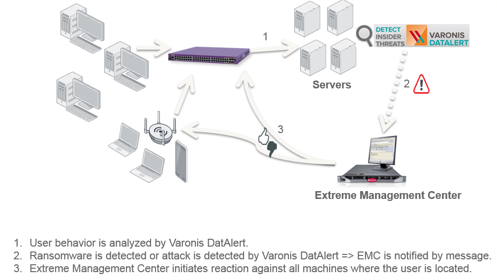

## Varonis DatAlert configuration
1. Run the  DatAlert configuration from the DatAdvantage menu
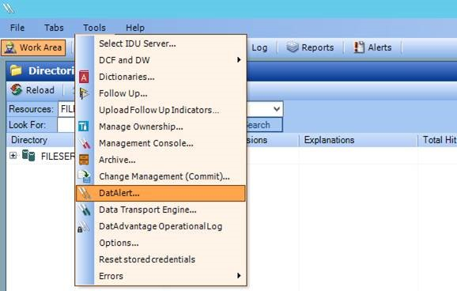

2. SYSLOG configuration in DatAlert
Syslog server IP address: IP address of Extreme Management Center
Identity is: Varonis-DatAlert

3. Create Alert Template for SYSLOG
Alert template format: Rule Name: <Rule Name> Acting Account: <Acting Object Domain Name>\<Acting Object SAM Account Name>
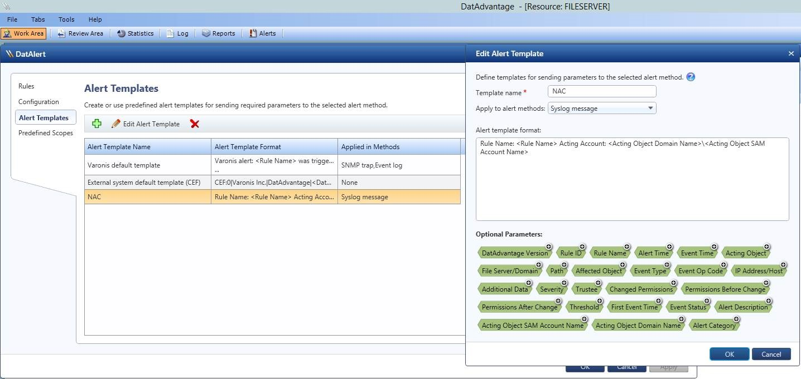

4. Enable SYSLOG message at the Alert method
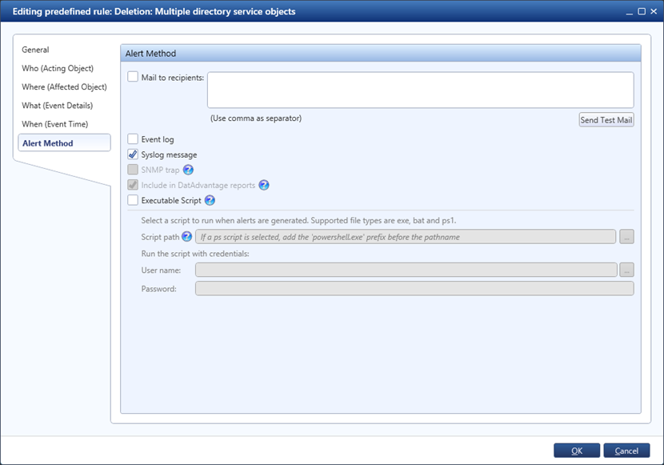

## Varonis DatAlert tuning
By default the DatAlert does report the information with 60 seconds delay. You may edit file: `Varonis\DatAdvantage\Probe\VrnsProbeSvc.exe.varonis.config` and shorten the time.

Find the section:`<configuration><probe><filer><win>` and replace original values with new values:

| Original value | New value |
| -------------- | --------- |
| `<add key="EnablePatternFilter" value="1"/>` | `<add key="EnablePatternFilter" value="0"/>` |
| `<add key="[long]QueueWaitTime" value="60000" />` | `<add key="[long]QueueWaitTime" value="10000" />` |

QueueWaitTime = how often does the sensor connect to file server and gather events. Value in miliseconds.

EnablePatternFilter = does filter temporary files which are part of short sequence of actions. Example is file deleted immediately after creation, file rename after creation.

## ExtremeManagement configuration
1. Import Workflow

   Download the [workflow](files/DatAlertWorkflow.xwf).

   OneView -> Tasks -> Workflows -> User Workflows -> Creage Group: DIPS

   OneView -> Tasks -> Workflows -> User Workflows -> DIPS -> Import

   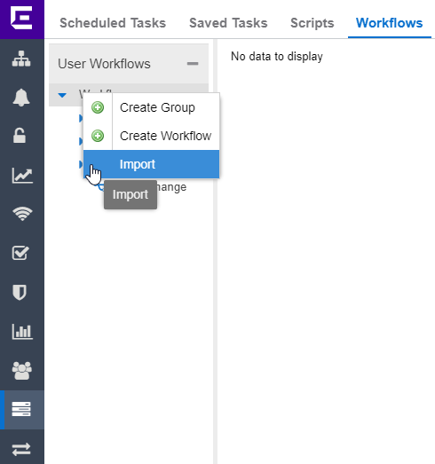

2. XMC Alarm configuration

   If the Syslog does contain phrase „Varonis-DatAlert“ then execute the workflow task.
   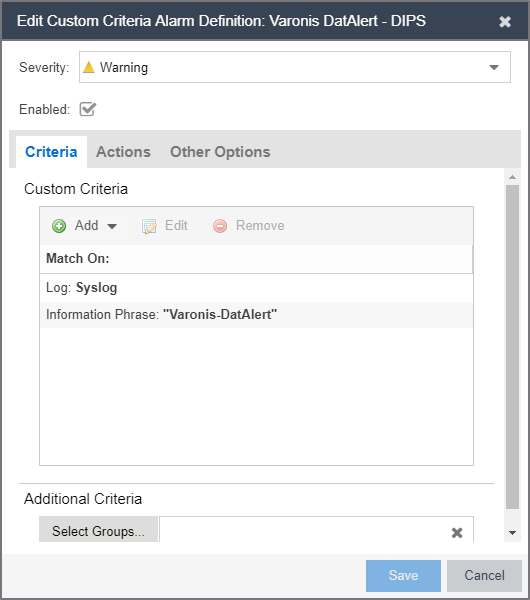
   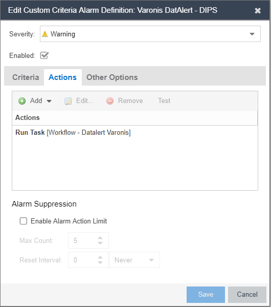
   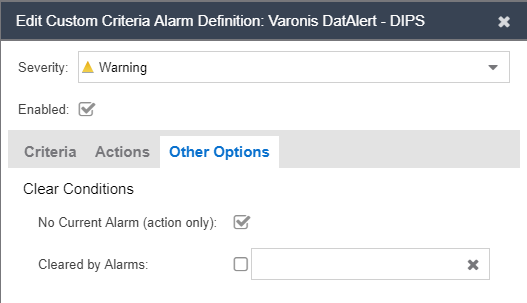

## Verification. If it is working...
1. The alert was detected by Varonis DatAlert.
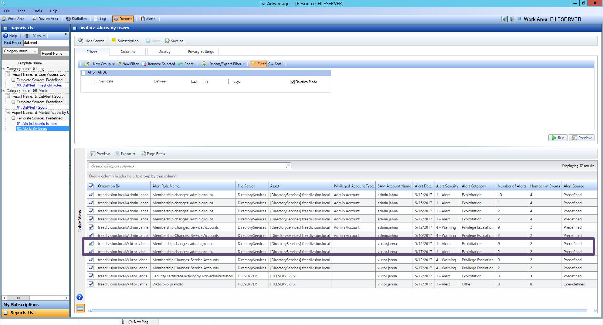
2. The end-system is quarantined.
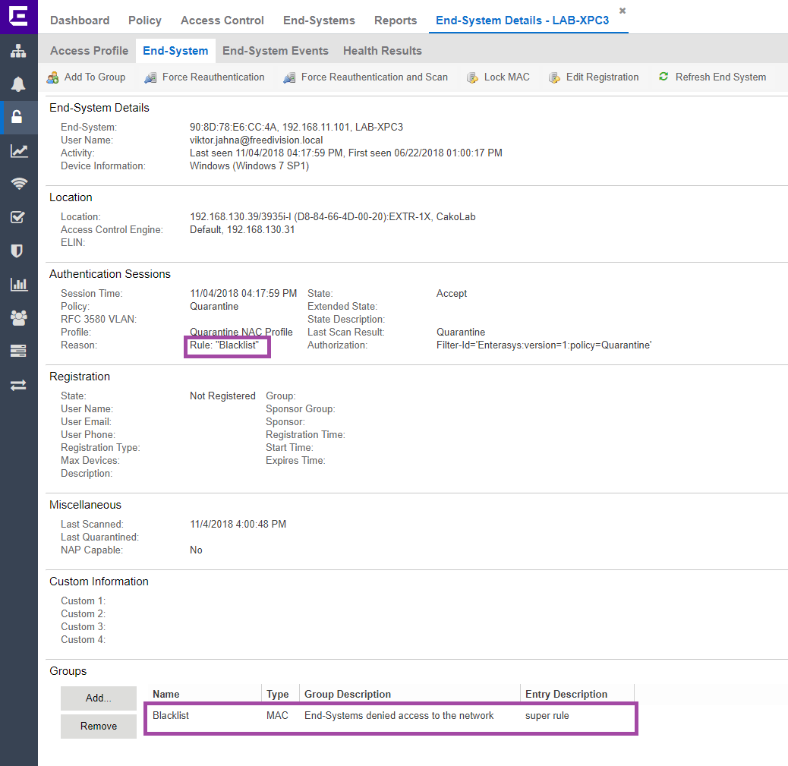
3. Extreme Management Center does report events.
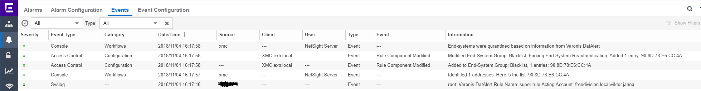
4. Workflow was successfully finished
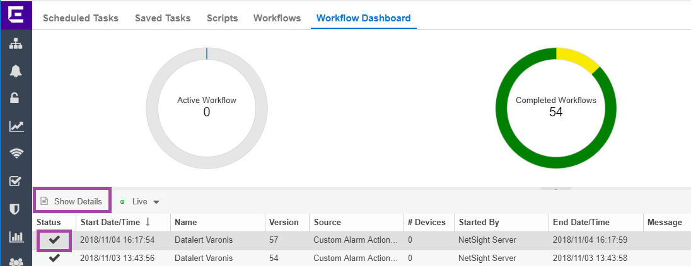
5. Workflow details
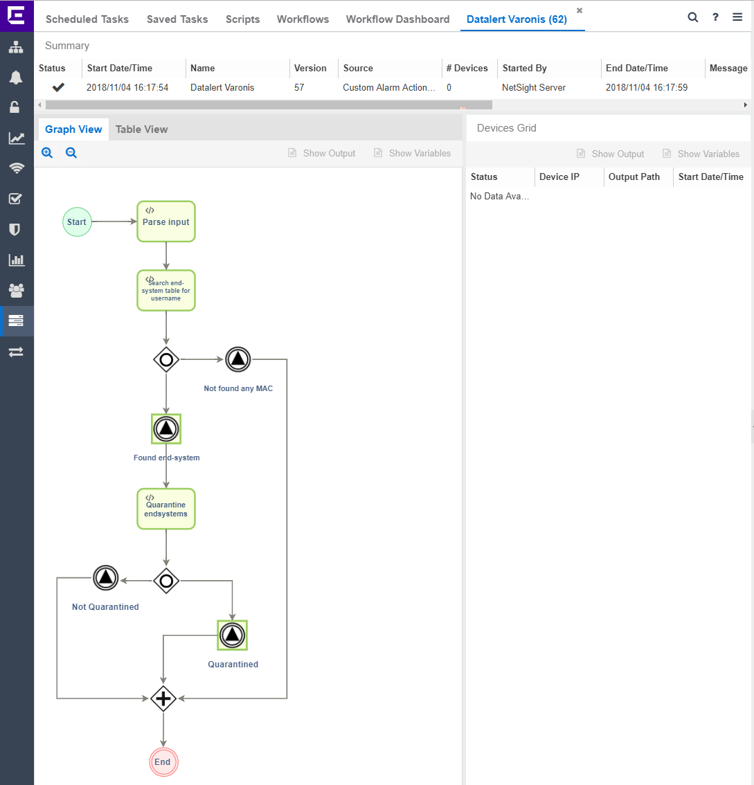

Tested versions:
* Extreme Management Center: 8.2.1.56
* Varonis DatAlert: 6.3.257.58

Older versions of ExtremeManagement:
* Extreme Management Center 8.0 - 8.1 does not have Workflow feature, the scripting apprach can be used. Here is [HowTo](files/ExtremeControl_DatAlert.pdf).

# Support
_The software is provided as-is and [Extreme Networks](http://www.extremenetworks.com/) has no obligation to provide maintenance, support, updates, enhancements, or modifications. Any support provided by [Extreme Networks](http://www.extremenetworks.com/) is at its sole discretion._

Issues and/or bug fixes may be reported on [The Hub](https://community.extremenetworks.com/extreme).

>Be Extreme
